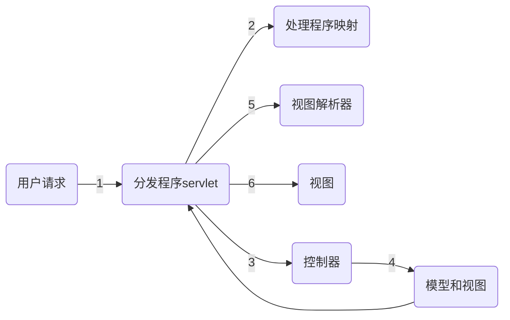
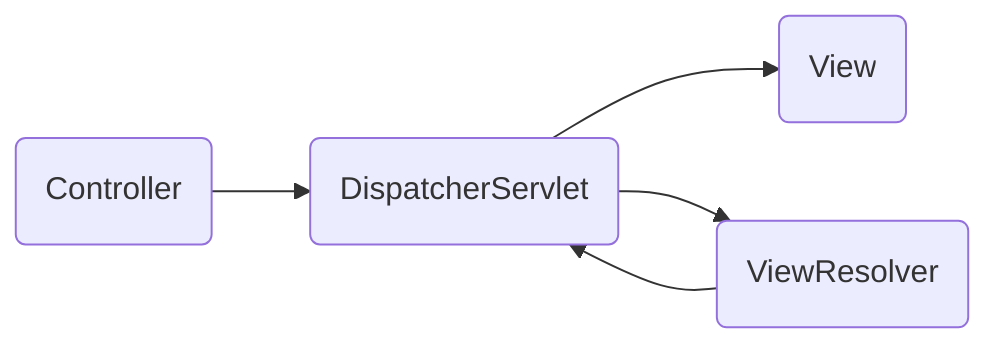

# Spring

[TOC]


## Spring概述

### WEB架构层

- 关系数据库层
- 表示层
- 业务层

### Spring使用简单POJO来克服的问题

- Web应用程序可能包含实现其核心功能所不需要的大量代码
- 单元测试困难
- j2ee设计模式由开发人员变更，其他应用不能使用这些设计模式
- 应用代码依赖于j2ee容器不能迁移至其他容器

### Spring功能

- 可插拔性
- 依赖注入(DI) DI松散耦合，无需自建与关联业务层对象，只需在Spring配置文件中描述如何创建与依赖，允许可插拔性易于维护重用
- 面向方面(AOP)
- 容器
- 轻量级

### SpringMVC优点

- 清晰分离控制器视图与模型
- 高度灵活
- 提供控制器
- 支持多种视图技术：jsp，velocity，tiles，jsf
- 通过依赖注入配置控制器
- 容易测试
- 验证器作为应用程序对象，不依赖于SpringAPI 而 struts需要借助StrutsAPI ActionForm.validate()

### Spring框架的七个模块

- 核心：提供基本功能，包含bean工厂 使用org.springframework.core包
- DAO（数据访问对象）：通过Hibernate、JDBC等标准化数据访问，编写简单数据库代码，无需考虑打开关闭数据库，提供异常层次结构 使用org.springframework.dao包
- ORM（关系映射）：将Spring框架与其他对象关系映射工具（Hibernate、iBatis）集成，**构建在DAO模块之上** 使用org.springframework.orm包
- AOP：面向切面，实现事务管理与安全性等，借助XML配置文件在应用程序中声明企业服务，使用org.springframework.aop包
- MVC：模型视图控制器，将模型应用、视图应用、用户界面分开实现松散耦合，可重用，可与其他MVC框架集成（struts等），使用org.springframework.web包
- 应用程序上下文：构建在**核心模块之上**，使Spring成为一个框架， 通过一致的SpringAPI获取对象与资源，基于bean工厂 支持消息、应用程序生命周期事件验证国际化，由Spring配置文件定义，为Spring框架提供上下文信息（bean定义、安全性、事务管理）还提供了一些企业级服务（JNDI、EJB、电子邮件、远程通信、日程安排），使用org.springframework.context包*
- Web上下文：属于Web应用程序开发堆栈（该堆栈包括MVC模块）构建于**应用程序上下文模块之上**，提供创建Web应用程序的上下文，支持Spring框架与Struts，WebWorks，JSF等框架集成，使用org.springframework.web包

## 实现依赖注入

web应用程序由大量逻辑组件组成，这些逻辑组件被称为应用程序对象，作为实现web应用程序业务目标的内聚单元。spring通过依赖注入（DI）概念管理应用程序对象

### Spring框架提供容器

- Bean工厂：提供对DI的支持 使用org.springframework.beans.factory.BeanFactory接口定义
- 应用程序上下文：基于bean工厂，提供如与SpringAOP集成、国际化等 使用org.springframework.context.ApplicationContext接口定义

### 介绍bean工厂

bean可以是Spring容器创建、管理的任何java对象或实例。bean工厂容器用于实例化、配置、管理bean，bean工厂创建的对象是完全配置、可使用、知道关系的，管理一创建对象生命周期也涉及bean工厂。

要实例化Web应用程序的bean工厂首先要加载bean配置文件，使用org.springframework.core.io.Resource接口定义的Rescource对象完成 可从不同位置加载bean配置文件。

### resource接口实现检索配置文件资源

- org.springframework.core.io.ByteArrayResource 一组字节资源
- org.springframework.core.io.ClassPathResource 指定路径*
- org.springframework.core.io.FileSystemResource 指定文件系统
- org.springframework.core.io.InputStreamResource 输入流
- org.springframework.web.context.support.ServletContextResource servlet上下文*
- org.springframework.core.io.UrlResource 给定URL

### bean标记属性

- id：唯一标识bean定义默认bean名称不可包含特殊字符
- name：指定bean别名可包含特殊字符
- class：指定bean类的全限定名
- scope：指定bean作用域 有singleton或prototype

### bean生命周期步骤

1. 实例化
2. 填充属性
3. 设置bean名称
4. 设置bean工厂
5. 预初始化
6. 初始化bean
7. 初始化后
8. bean可使用
9. 销毁bean

### 应用程序上下文介绍

应用程序上下文是高级容器，继承了BeanFactory接口的所有功能，所以ApplicationContext更常用，缺乏资源用bean工厂

#### 企业级功能

- 提供解析文本消息的方式与消息国际化
- 提供加载图像之类文件资源的常规方法
- 将事件发布到作为侦听器注册的bean

#### 应用程序上下文常用实现

- ClassPathXmlApplicationContext 指定路径找配置文件
- FileSystemXmlApplicationContext 文件系统找配置文件
- XmlWebApplicationContext web.xml上下文参数contextConfigLocation找配置文件

ClassPathXmlApplicationContext例

```java
ApplicationContext = new ClassPathXmlApplicationContext("Sport/Spring-Config.xml");
```

FileSystemXmlApplicationContext例

```java
ApplicationContext = new FileSystemXmlApplicationContext("C:/Sport/Spring-Config.xml");
```

XmlWebApplicationContext例

```java
ApplicationContext = new XmlWebApplicationContext();
```

bean工厂只有在调用getBean()时才创建bean， 应用程序上下文一旦启动就会预加载所有bean

#### 应用程序上下文bean生命周期步骤

1. 实例化
2. 填充属性
3. 设置bean名称
4. 设置bean工厂
5. 设置应用程序上下文
6. 预初始化
7. 初始化bean
8. 初始化后
9. bean可使用
10. 销毁bean

### 注入应用程序对象

应用程序对象之间创建和管理的过程形成了依赖注入DI核心并被成为装配

#### 完成装配的方式

- 显示装配：根据配置文件中的显式声明
- 自动装配：由容器自动确定

#### 显式装配

可用设值注入(setter)和构造函数注入，通过\<property>元素配置，其中又可以注入简单值或引用其他bean

示例代码(setter)

```java
package SetterInject;
public interface Player{
    void play();
}
```

```java
package SetterInject;
public class FootballPlayer implements Player{
    private String football;
    private FootballBoots boots;
    public FootballPlayer() {};
    @Override
    public void play() {
        System.out.plintln("I am playing with " + football + " football.");
    }
    public void setFootball(String football) {
        this.football = football;
    }
    public void setBoots(FootballBoots boots) {
        this.boots = boots;
    }
}
```

```java
package SetterInject;
public interface FootballBoots{
    void wearBoots();
}
```

注入简单值

```xml
<bean id="Kaka" class="SetterInject.FootballPlayer">
	<property name="fotball" value="Adidas"/>
</bean>
<bean id="Forlan" class="SetterInject.FootballPlayer">
	<property name="fotball" value="Nike"/>
</bean>
```

```java
package SetterInject;
public class Predator implements FootballBoots {
    public Predator() {};
    @Override
    public void wearBoots() {
        System.out.plintln("I am wearing Adids predator boots.");
    }
}
```

引用其他bean

```xml
<bean id="predator" class="SetterInject.Predator"/>
<bean id="Kaka" class="SetterInject.FootballPlayer">
	<property name="fotball" value="Adidas"/>
    <property name="boots" ref="predator"/>
</bean>
<bean id="Forlan" class="SetterInject.FootballPlayer">
	<property name="fotball" value="Nike"/>
	<property name="boots" ref="predator"/>
</bean>
```

执行输出

```
I am playing with Adidas football. I am wearing Adids predator boots.
I am playing with Nike football. I am wearing Adids predator boots.
```

示例代码(构造函数)

```java
package SetterInject;
public class FootballPlayer implements Player{
    private int shirtNumber;
   	public FootballPlayer() {};
    public FootballPlayer(int shirtNumber) {
        this.shirtNumber = shirtNumber;
    };
    @Override
    public void play() {
        System.out.plintln("I am playing with " + football + " football.");
    }
}
```

```xml
<bean id="Kaka" class="SetterInject.FootballPlayer">
	<constructor-arg value="7"/>
</bean>
<bean id="Forlan" class="SetterInject.FootballPlayer">
	<constructor-arg value="21"/>
</bean>
```

执行输出

```
I am playing with shirt nubmer 7.
I am playing with shirt nubmer 21.
```

#### 自动装配

紫铜装配通过设置对被装配bean配置autowire完成

##### autowire属性

- byName： 寻找名称与被装配属性匹配的bean，找不到不匹配
- byType：寻找类型与被装配属性类型匹配的bean找不到不装配，找到多个抛出org.springframework.beans.factory.UnsatisfiedDependencyException异常
- constructor：尝试将容器中的一个或多个bean与被装配bean构造函数匹配，构造函数或bean中存在二义性抛出org.springframework.beans.factory.UnsatisfiedDependencyException异常
- autodetect：如果有默认无参构造先尝试用constructor然后用byType尝试装配bean

通过名称

```xml
<bean id="boots" class="SetterInject.Predator"/>
<bean id="Kaka" class="SetterInject.FootballPlayer" autowire="byName">
	<property name="football" value="Adidas"/>
</bean>
```

通过类型

```xml
<bean id="boots" class="SetterInject.Predator"/>
<bean id="Kaka" class="SetterInject.FootballPlayer" autowire="byType">
	<property name="football" value="Adidas"/>
</bean>
```

如果找到多个类型相符的bean将抛出异常，所以需要只有一个bean可以匹配自动装配的类型。

构造函数

```java
package AutowireInject;
public class RugByPlayer implements Player{
    privite RugByBoots rugByBoots;
    private int shirtNumber;
    
    public RugByPlayer(RugByBoots rugByBoots) {
        this.rugByBoots = rugByBoots;
    }
    public int getShirtNumber() {
        return shirtNumber;
    }
    public void setShirtNumber(int shirtNumber) {
       this.shirtNumber = shirtNumber;
    } 
    @Override
    public void play() {
        System.out.println("I am playing with shirt number " + shirtNumber + 
                           " and " + rugByBoots.getBoots() + " rugby boots.");
    }
}
```

```java
package AutowireInject;
public class RugByBoots{
    private String boots;
    public String getBoots() {
        return boots;
    }
    public void SetBoots(String boots) {
        this.boots = boots;
    }
}
```

```xml
<bean id="Wilkinson" class="AutowireInject.RugByPlayer" autowire="constructor">
	<property name="shirtNumber" value="7"/>
</bean>
<bean id="NikeBoots" class="AutowireInject.RugByBoots">
	<property name="boots" value="Nike"/>
</bean>
```

执行输出

```
I am playing with shirt number 7 and Nike rugby boots.
```

如果有多个可被装配的bean会抛出异常，如果有多个构造函数也会抛出异常

自动检测

```
<bean id="Kaka" class="SetterInject.FootballPlayer" autowire="autodetect"/>
```

先构造函数后byType

#### 使用默认自动装配

需要在beans元素中配置default-autowire

```xml
<beans default-autowire="byType">...</beans>
```

#### 显式装配与自动装配结合

可以对任何属性使用\<property>或\<constructor-arg>，会覆盖已经自动装配过的属性。

使用byType时可以显式装配有二义性的属性如下

```xml
<bean id="Kaka" class="SetterInject.FootballPlayer" autowire="byType">
    <property name="football" value="Adidas"/>
    <property name="boots" value="boot2"/>
</bean>
<bean id="boot1" class="SetterInject.Predator"/>
<bean id="boot2" class="SetterInject.Predator"/>
```

\<constructor-arg>不能与构造函数自动装配混合。

## Spring与Web层集成

### SpringMVC

#### SpringMVC具有的胜过其他MVC框架的功能

- 可插拔视图技术：支持各种视图技术，如JSP、Tiles、JSF
- 将服务注入控制器：结合了Spring优点，如依赖注入与AOP，可以将业务层对象隐式注入控制器以减少用户界面和业务逻辑层之间代码的冗余
- 集成支持：支持与Struts与Hibernate等其他控件集成

#### MVC设计模式组成

- 模型：应用程序存留的数据
- 视图：应用程序用户界面
- 控制器：负责接收用户请求并将其传递给模型进行操作，基于操作结果由控制器指向对应视图

#### SpringMVC处理用户请求利用的组件

- 处理程序映射：使分发程序servlet能将传入请求转发到适当的控制器
- 控制器：处理请求生成响应（包括视图逻辑名称）
- 视图解析器：将控制器返回的视图逻辑名称解析为实际视图
- 视图：向用户显示响应

#### SpringMVC框架优点

- 易于测试
- 可重用的应用程序代码
- 简单强大的标记库
- 支持多种视图技术与Web框架

#### Web请求的生命周期

Web应用程序的web.xml包含关于如何处理某个Web请求的信息，当服务器收到请求将读取web.xml并将请求转发至负责处理的servlet



##### 请求生命周期

1. 请求抵达分发程序servlet
2. 分发程序servlet咨询一个或多个处理程序确定对应控制器
3. 分发程序servlet将请求转发给控制器
4. 控制器以逻辑视图名称与数据对象发送请求给分发程序servlet
5. 分发程序servlet请求视图解析器将逻辑视图名称解析为视图
6. 视图实现，交付模型数据并通过响应发送给浏览器

### Web请求

#### 使服务器支持Spring的MVC Web应用程序中的Web请求

1. 创建和配置分发程序servlet
2. 创建对应控制器类
3. 在分发程序servlet上下文配置中配置控制器
4. 声明视图解析器将控制器与视图绑定
5. 创建视图渲染请求页面

#### 创建和配置分发程序servlet

分发程序servlet由org.springframework.web.servlet.DispatherServlet类表示，DispatherServlet与Spring框架的ApplicationContext集成。

分发程序servlet需要在web.xml中通过\<servlet>与\<servlet-mapping>声明和配置

dispatcher-servlet.xml

```xml

<servlet>
	<servlet-name>dispatcher</servlet-name>
    <servlet-class>org.springframework.web.servlet.DispatherServlet</servlet-class>
    <load-on-startup>1</load-on-startup>
</servlet>
```

web.xml

```xml
<servlet-mapping>
	<servlet-name>dispatcher</servlet-name>
    <url-pattern>*.htm</url-pattern>
</servlet-mapping>
```

上述代码\*.hml表示扩展名为.hml的所有被请求URL都由分发程序servlet处理，若配置为\*.\* 表示分发servlet可以处理任何扩展名的所有被请求URL

#### 创建和配置控制器

编写一个类并注解为@Controller,假设已经配置了分发程序servlet TickDispatcher，创建机票预定控制器BookController

```java
package controller;
import bookTickets.Passenger;
import org.springframework.stereotype.Controller;
import org.springframework.ui.ModelMap;
import org.springframework.web.bind.annotation.ModelAttribute;
import org.springframework.web.bind.annotation.RequestMapping;
import org.springframework.web.bind.annotation.RequestMethod;
import service.BookService;

@Controller
@RquestMapping(value="/BookTickets.hmt")
public class BoolController {
    private BookService bookService;
    public BookService getBookService() {
        return bookService;
    }
    public void setBookService(BookService bookService) {
        this.bookService = bookService;
    }
    @RequestMapping(method=RequestMethod.GET)
    Public String processForm(ModelMap model) {
        Passenger p = new Passenger();
        model.addAttribute("Passenger", p);
        return "BookTickets";
    }
    @RequestMapping(method=RequestMethod.POST)
    Public String processFrom(@ModelAttribute(value="Passenger") Passenger p, ModelMap model){
        model.addAttribute("helloMessage", bookService.sayHello(p.getNumTravellers()));
        return "BookConfirmed";
    }
    
}
```

BookService

```java
package service;
public class BookService {
    public String sayHello(String num) {
        return "Congratulations!!! The tickets have been booked for " + num + " travellers.";
    }
}
```


#### @RequestMapping()

- value：指定类充当控制器的URL
- method：指定http请求方法
  1. RequestMethod.GET
  2. RequestMethod.POST

控制器不自己处理请求，而是将请求委托给对应service服务类如上述BokService。

控制器以org.springframework.ui.ModelMap类返回的ModelMap对象的形式将结构转发回浏览器

#### ModelMap中addAttribute方法

```java
public ModelMap addAttribute(String attributeName, Object attributeValue)
```

- attributeName：要添加到ModelMap对象的属性名
- attributeValue：要添加到ModelMap对象的对象

#### 在分发程序servlet中配置控制器

以上述BookController为例配置TickerDispatcher-servlet.xml

```xml
<bean name="BookController" class="org.springframework.web.servlet.mvc.ParameterizableViewControler" p:viewName="BookTickets" />

<bean class="controller.BookController" p:bookService-ref="bookService" />
```

#### 修改applicationcontext.xml通过注解创建控制器类的自动检测

```xml
<?xml version="1.0" encoding="UTF-8"?>
<beans xmlns="http://www.springframework.org/schema/beans"
       xmlns:xsi="http://www.w3.org/2001/XMLSchema-instance"
       xmlns:context="http://www.springframework.org/schema/context"
       xmlns:mvc="http://www.springframework.org/schema/mvc"
       xis:schemaLocation="http://www.springframework.org/schema/beans
           http://www.springframework.org/schema/beans/spring-beans-3.0.xsd
           http://www.springframework.org/schema/context
           http://www.springframework.org/schema/context/spring-context-3.0.xsd
           http://www.springframework.org/schema/mvc
           http://www.springframework.org/schema/mvc/spring-mvc-3.0.xsd
           ">
	<bean id="messageSource" class="org.springframework.context.support.ReloadableResurceBundleMessageSource">
    	<property name="basename" value="/WEB-INF/messages"/>
        <preperty name="cacheSeconds" value="3000" />
    </bean>
    <context:component-scan base-package="controller"/> <!-- * -->
    <mvc:annotation-driven /> <!-- * -->
    <bean id="viewResolver" class="org.springframework.web.servlet.view.InternalResourceViewResolver">
    	<property name="prefix" value="/WEB-INF/jsp/"/>
        <property name="suffix" value=".jsp"/>
    </bean>
    <bean name="bookService" class="service.BookService"/>
    <bean id="bookController" class="controller.BookController">
    	<porperty name="bookService" ref="bookService"/>
    </bean>
</beans>
```

上述代码中\<context:component-scan>标记用于在Spring中启用自动扫描base-package指定需扫描文件夹找出并注册带有@Controller注解的bean，\<mvc:annotation-driven>标记指定应用程序支持注解驱动的MVC控制器。

#### 将请求映射到控制器

Spring中处理映射由org.springframework.web.servlet.HandlerMapping接口表示

**映射实现类**

- BeanNameUrlHandlerMapping
- SimpleUrlHandlerMapping
- ControllerClassNameHandlerMapping

考虑用户访问以下URL

1. http://myurl.com/account/showAccount
2. http://myurl.com/account/createAccount
3. http://myurl.com/account/deleteAccount

##### BeanNameUrlHandlerMapping

使用org.springframework.web.servlet.handler.BeanNameUrlHandlerMapping类

```xml
<beans>
    <bean id="beanhandlermapping" class="org.springframework.web.servlet.handler.BeanNameUrlHandlerMapping" />
	<bean name="/showAccount.htm" class="controller.ShowAccountController"/>
    <bean name="/createAccount.htm" class="controller.CreateAccountController"/>
   	<bean name="/deleteAccount.htm" class="controller.DeleteAccountController"/>
</beans>
```

##### SimpleUrlHandlerMapping

使用org.springframework.web.servlet.handler.SimpleUrlHandlerMapping类

```xml
<beans>
    <bean id="showAccountController" class="controller.ShowAccountController"/>
    <bean id="createAccountController" class="controller.CreateAccountController"/>
    <bean id="deleteAccountController" class="controller.DeleteAccountController"/>
    <bean id="simplehandlermapping" class="org.springframework.web.servlet.handler.SimpleUrlHandlerMapping">
    	<property name="mapping">
        	<props>
                <prop key="/showAccount.htm">showAccountController</prop>
                <prop key="/createAccount.htm">createAccountController</prop>
                <prop key="/deleteAccount.htm">deleteAccountController</prop>
            </props>
        </property>
    </bean>
</beans>
```

##### ControllerClassNameHandlerMapping

使用org.springframework.web.servlet.handler.ControllerClassNameHandlerMapping类

```xml
<beans>
	<bean id="ControllerClassNameHandlerMapping" class="org.springframework.web.servlet.handler.ControllerClassNameHandlerMapping"/>
	<bean class="controller.ShowAccountController"/>
    <bean class="controller.CreateAccountController"/>
    <bean class="controller.DeleteAccountController"/>
</beans>
```

#### 将响应渲染至客户机

- 声明视图解析器
- 创建视图

##### 声明视图解析器

Spring使用视图解析器将逻辑通名称解析为视图



Spring利用org.springframework.web.servlet.ViewResolver接口执行此任务

**ViewResolver接口**

- InternalResourceViewResolver
- BeanNameViewResolver
- ResourceBundleViewResolver
- XmlViewResolver

例如渲染JSP视图使用InternalResourceViewResolver

```xml
<bean id="viewResolver" class="org.springframework.web.servlet.view.InternalResourceViewResolver" p:prefix="WEB-INF/jsp" p:suffix=".jsp"/>
```

##### 创建视图

Spring提供了自己的标记库来创建视图

使用spring标记库需要在视图中包含以下指令

```jsp
<%@taglib uri="http://www.springframework.org/tags" prefix="spring" %>
```

**Spring标记库标记**

- \<spring:bing>将bean属性与表单组件绑定，包括一个path用于指定需要与表单组件绑定的bean属性路径

  假设将input与Student bean的name绑定

  ```jsp
  <spring:bind path="Student.name">
      <input type="text" name="${status.expression}" value="${status.value}"/>
  </spring:bind>
  ```

  1. status.expression：用于返回表示bean属性的表达式，提交表单时Spring使用此表达式将表单组件与bean属性绑定

  2. status.value：用于返回bean的属性值

  3. status.nestedPath指定\<spring:bind>标记path的前缀路径

     ```xml
     <spring:nestedPath path="Student">
         <spring:bind path="name">
         	<input type="text" name="${status.expression}" value="${status.value}"/>
     	</spring:bind>
         <spring:bind path="age">
         	<input type="text" name="${status.expression}" value="${status.value}"/>
     	</spring:bind>
     </spring:nestedPath>
     ```

## 实现AOP

### 介绍AOP

Web应用程序中有多个服务不属于应用程序的主业务逻辑的组成部分，如登录、安全性和事务管理，可以将这些服务视为横切关注点，因为它们趋向于横跨应用程序的多个模块。通过在应用程序的多个模块实现这些关注点可能会引入如下复杂性

- 这些服务对于Web是必需的，需要在每个模块中实现，所以这些横切关注点代码在应用程序多个模块间是重复的，一旦更改需要更改每个模块，即使为这些横切关注点创建了单独的模块也需要在每个模块中写代码调用。
- 应用程序模块包含于核心功能无关的代码。

为了降低复杂性简化程序结构Spring提供了面向方面编程（AOP）

#### AOP功能

- 将次要逻辑与主逻辑隔离增加模块性
- 提供封装如高速缓存、安全性、持久性、事务之类的横切关注点，将这些模块与核心应用程序分离
- 可以通过Java类中定义方法实现方面减少重复代码。
- 能够轻松删除先前定义的功能

#### AOP组件

- 通知：是切入切点的时机，是方面的执行操作，用于表示应用程序的次要关注点。（订票中诸如验证用户、检查座位可用性、更新剩余票数之类的次要工作这些可以为前置通知或后置通知）
- 连接点：是应用程序的点或位置，可在该处插入通知。（主逻辑是订票所以包含订票逻辑的**方法**为连接点）
- 切入点：定义特定通知应用于哪个连接点。（订票所有通知的切入点为订票方法book()这个3-）
- 目标：是方面应用到的对象，所以执行应用程序主逻辑的类被称为目标对象。（实现订票主逻辑的类）
- 代理：包裹目标对象并截取该对象所作的所有调用
- 织入：在指定连接点将方面应用到目标对象以创建新的被代理对象的过程。

### 实现AOP

#### 注解实现

SpringAOP借助AspectJ的语法  可以通过@EnableAspectJAutoProxy注解开启（SpringBoot引入依赖后默认开启）

可以通过@Aspect 将一个类声明为一个切面

@Pointcut声明切点，使用指示符execution匹配方法执行的连接点

使用@Before @AfterReturning @AfterThrowing @After @Around声明通知

为top.suvvm.dao包下所有方法添加前置通知

```java
@Component
@Aspect
public class SuvvmAspect {	// 这是一个切面
    @Pointcut(execution(* top.suvvm.dao..*.*(..)))
    private void xxxTransfer(){}	//这是一个切点里面包含一些连接点
    
    @Before("xxxTransfer()")
    public void advice() {	//这是一个前置通知
        // do some things
    }
}
```


#### Xml实现

以上述订票为例

用于订票book()方法的BookTicketInterface

```java
public interface BookTicketInterface {
    void book(String numTravelers, String trnPass);	//乘客人数与交易密码
}
```

BookTicket

```java
package AOP;
public class BookTicket implements BookTicketInterface {
    @Override
    public void book(String numTravelers, String trnPass) {
        // 各种订票代码实现
    }
}
```

要实现AOP要执行以下操作

- 创建通知
- 定义切入点
- 创建代理

##### 创建通知

通知种类

- 前置通知：在连接点（book()）前执行，需导入org.springframework.aop.MethodBeforeAdvice接口，该接口包含before()方法

  ```java
  public void before(Method method, Object[] args, Object target) throws Throwalbe
  ```

  1. method 通知将应用到的方法
  2. args 调用方法是传递给方法的参数
  3. target 方法调用的目标（对其调用方法的对象）

- 返回后通知：在连接点正常执行完成后执行，需导入org.springframework.aop.AfterReturningAdvice接口，该接口包含afterReturning()方法

  ```java
  public void afterReturning(Object returnValue, Method method, Object[] args, Object target) throws Throwalbe
  ```

  1. returnValue 保存从被调用的方法返回的值

- 抛出后通知：在抛出异常后执行，需导入org.springframework.aop.ThrowsAdvice接口，该接口包含afterThrowing()方法BookTicketApp

  ```java
  public void afterThrowing(Throwable throwable)
  ```

  1. 应由通知处理的异常

BookTicketApp

```java
package AOP;
public class BookTicketApp {
    private String password;	// 用户交易密码
    private String travelers;	// 乘客数
    public String getPassowrd() {
        return password;
    }
    public void setPassword(String password) {
        this.password = password;
    }
    public String getTravelers() {
     	return travelers;   
    }
    public void setTravelers(String travelers) {
        this.travelers = travelers;
    }
}
```

HandleRequestController

```java
@Controller
@RequestMapping(value="/BookTicket.htm")
public class HandleRequestController {
    @RequestMapping(method=RequestMethod.GET)
    public String showView(ModelMap model) {
        BookTicketApp bt = new BookTicketApp();
        model.addAttribute("book", bt);
        return "BookTicket";
    }
    @RequestMapping(method=RequestMethod.POST)
    public String processView(@ModelAttribute("book") BookTicketApp bt, ModelMap model) {
        ApplicationContext ctx = new ClassPathXmlApplicationContext("AOP/Config.xml");
        BookTicetInterface perf=(BookTickInterface)ctx.getBean("bookProxy");
        // 如果用户验证成功将对于用户验证结果，总价格信息，奖励信息加入ModelMap
        // 否则将错误信息加入ModelMap
        return "BookTicket";
    }
}
```

主要功能机票预定，次要工作验证用户、检查座位可用性、更新座位、奖励礼券等

SecondaryJob类

1. 验证用户
2. 检查座位可用性
3. 更新订票后的可用座位数
4. 奖励礼券

```java
package AOP;
public class SecondaryJob {
    
    // 验证用户
    public void authenticate(String pwd){
        // 成功记录 User is Authenticated
        // 失败记录 Authentiction Failed. Please Enter a Valid Transaction Password.
    }
    // 验证座位
    public void checkSeatsAvailability(String numTrav){
   		// 对比传入的乘客数与座位总数
        // 成功记录成功信息
        // 失败记录失败信息
    }
    // 更新订票后的可用座位数
    public void updateSeat(String numTrav){
        // 现有座位减去传入的乘客数
        // 上一步验证座位成功记录成功信息
        // 上一步验证座位失败不做记录
    }
    // 奖励方法
    public void rewardGift(String numTrav) {
        // 验证座位且超过1000美元就记录奖励信息
        // 否则什么也不记录
    }
}
```

在Spring配置文件Config.xml中配置SecondaryJob

```xml
<bean id="sj" class="AOP.SecondaeyJob" />
```

**之后便是配置通知**

- 使用java类
- 使用配置元素

##### 使用JAVA类

创建SeconaryJobAdvice实现通知

```java
package AOP;
import java.lang.reflect.Method;
import org.springframework.aop.AfterReturningAdvice;
import org.springframework.aop.MethodBeforeAdvice;

public class SecondaryJonAdvice{
    public class SecondaryJobAdvice implements MethodBeforeAdvice,AfterReturningAdvice{
        public SecondaryJob secondary;
        // 前置
        @Override
        public void before(Method method, Object[] args, Object target) throws Throwable{
            secondary.authenticate(args[1].toString());
            secondary.checkSeatsAvailability(args[0].toString());
        }
        // 返回后
        @Override
        public void afterReturning(Object returnValue, Method method, Object[] args, Object target) throws Throwable{
            secondary.updateSeat(args[0].toString());
            secondary.rewardGift(args[0].toString());
        }
        public void setSecondary(SecondaryJob secondary) {
            this.secondary = secondary;
        }
    }
}
```

之后需要在Spring配置文件Config.xml将上方类配置为bean

```xml
<bean id="secondaryJobAdvice" class="AOP.SecondaryJobAdvice">
	<property name="secondary" ref="sj"/>
</bean>
```

##### 使用配置元素

可用使用Spring配置文件中的aop名称空间

```
xmlns:aop="http://www.springframework.org/schema/aop"
```

**配置元素**

- \<aop:config>：SpringAop配置元素 用于定义所有AOP配置
- \<aop:aspect>：用于声明方面，具有引用Spring配置文件中定义的相应方面bean的ref属性
- \<aop:before>：用于定义前置通知
- \<aop:after-returning>：返回后通知
- \<aop:atter-throwing>：抛出后通知
- \<aop:around>：配置之前和返回后都执行的方法

```xml
<aop:config>
	<aop:aspect ref="js">
    	<aop:before method="authenticate"/>
        <aop:before method="checkSeatsAvailability"/>
        <aop:after-returning method="updateSeats"/>
        <aop:after-returning method="rewardGift"/>
    </aop:aspect>
</aop:config>
```

##### 定义切入点

切入点在Srping配置文件中定义Spring提供了org.springframework.aop.support.JdkRegexpMethodPointcut类，该类允许使用正则表达式定义切入点，此类有一个名为pattern的属性，其value属性用于指定引用通知可以应用到的方法的特定模式

例如：value属性为PrimaryJob.*book的模式将把通知应用于PrimaryJob类中任何以book结尾的方法

为用户预定机票的方法名为book()这里将book指定为模式的切入点

```xml
<bean id="bookingPointCut" class="org.springframework.aop.support.JdkRegexpMethodPointcut">
	<prorerty neme="pattern" value=".*book"/>
</bean>
```

定义了切入点后还需要定义将那些通知应用到该切入点，所以要创建将通知与切入点相链接的通知器，Spring提供org.springframework.aop.support.DefaultPointcutAdvisor类来创建通知器

以上方机票预定程序为例

```xml
<bean id="secondarryJobAdvisor" class="org.springframework.aop.support.DefaultPointcutAdvisor">
	<property name="advice" ref="secondaryJobAdvice"/>
    <property name="pointcut" ref="bookingPontCut"/>
</bean>
```

上述代码创建了将secondaryJobAdvice bean与bookingPointCut bean所定义的切入点相链接的secondaryJobAdvisor bean

也可以使用Spring配置元素来定义切入点

\<aop:pointcut>元素用来定义切入点此元素包含名为expression的属性，此属性用于定义执行连接点方法的表达式，语法：

```
expression = "execution(regular_expression)"
```

regular_expression为精确确定需要执行哪种方法的切入点表达式

使用pointcut-ref属性可在多个通知元素之间引用切入点。

以机票预定程序为例

```xml
<aop:config>
	<aop:aspect ref="js">
        <aop:pointcut id="pointcut" expression="execution(* book*())">
            <aop:before method="authenticate" pointcut-ref="pointcut"/>
            <aop:before method="checkSeatsAvailability" pointcut-ref="pointcut"/>
            <aop:after-returning method="updateSeats" pointcut-ref="pointcut"/>
            <aop:after-returning method="rewardGift" pointcut-ref="pointcut"/>
        </aop:pointcut>
    </aop:aspect>
</aop:config>
```

##### 创建代理

创建通知器后还需要创建调用该通知类的代理，代理充当通知、目标对象、连接点、切入点和通知器之间的链接，Spring提供了org.springframework.aop.config.ProxyFactory类

所需参数

- target：指定想要代理的目标对象
- interceptorNames： 已在Spring配置文件中定义的通知器bean名称的列表
- proxyInterfaces：指定应用程序主逻辑界面的名称

```xml
<bean id="inst" class="AOP.BookTicket"/>
<bean id="bookProxy" class="org.springframework.aop.config.ProxyFactory">
	<property name="target" ref="inst"/>
    <property name="interceptorNames" value="secondaryJovAdvisor"/>
    <property name="proxyInterface" value="AOP.BookTicketInterface"/>
</bean>
```

创建了bookProxy bean目标对象时主逻辑类BooKTicket通知器为secondaryJovAdvisor bean

主逻辑界面为声明book()方法的BookTicketInterface接口

要从HandleRequestController调用代理以订票要添加如下

```java
@RequestMapping(method=RequestMethod.POST)
public String processView(@MedelAttribute("book") BookTicketApp bt, ModelMap model) {
    ApplicationContext ctx = new ClassPatchXmlApplicationContext("AOP/Config.xml");
    BookTicketInterface perf = (BootTicketInterface)ctx.getBean("bootProxy");
    perf.book(bt.getTravelers(), bt.getPassword());
    ……
}
```

#### 踩坑警告

当开启springAOP功能时，spring将通过CDLIB生成连接点所在对象的子类作为代理类，CGLIB将直接生成字节码而不经过Java编译器，所生成的子类在构造时不会调用super()，也就是说代理类不会初始化任何成员变量，包括final类型的成员变量，所以使用方法调用连接点所在对象中的属性。

## 将Spring与业务层和表示层集成

### Spring集成JSF

#### 解析JSF Bean

在JSF配置文件faces-config.xml声明JSF受管Bean JsfBean

```xml
<managed-bean>
	<managed-bean-name>JsfBean</meanaged-bean-name>
    <managed-bean-class>JsfManagedBean</meanaged-bean-class>
    <managed-bean-scop>request</managed-bean-scop>
</managed-bean>
```

#### 添加Spring框架

在jsf应用程序中添加Spring框架需要在web.xml中提供applicationContext.xml的映射

```xml
<context-param>
	<param-name>contextConfigLocation</param-name>
    <param-value>/WEB-INF/applicationContext.xml</param-value>
	<listener>
    	<listener-class>org.springframework.web.context.ContextLoaderListener</listener-class>
    </listener>
</context-param>
```

上段代码是在web.xml中声明ContextLoaderListener侦听器类以加载Spring上下文，之后applicationContext.xml中声明的bean将在整个应用程序中可见

之后还要声明程序分发servlet

web.xml

```xml
<servlet>
	<servlet-name>dispatcher</servlet-name>
    <servlet-class>org.springframework.web.servlet.DispatherServlet</servlet-class>
    <load-on-startup>1</load-on-startup>
</servlet>
<servlet-mapping>
	<servlet-name>dispatcher</servlet-name>
    <url-pattern>*.htm</url-pattern>
</servlet-mapping>
```

#### 解析Spring Bean

为了调用Spring应用程序上下文中声明的Spring bean，Spring框架提供org.springframework.web.jsf.el.SpringBeanFaccesELResolver类此类在faces-config.xml文件的\<el-resover>中指定

```xml
<application>
	<el-resolver>org.springframework.web.jsf.el.SpringBeanFacesELResolver</el-resolver>
</application>
```

上述代码声明的SpringBeanFacesELResolver bean变量解析器首先尝试从Spring应用上下文文件解析bean，如果不能解析bean，解析器将查找JSFbean变量解析器中是否有同名bean。

JSF受管bean JsfBean在Spring applicationContext.xml中

```xml
<bean id="JsdBean" class="JsfManagedBean" scope="request"></bean>
```

### Spring集成Hibernate

Hubernate是ORM（对象关系映射工具）Spring位于应用程序类和ORM之间，集成后可将Hibernate对象作为Spring bean使用。

#### Hibernate功能

- 提供对象\关系映射
- 支持基本面向对象原则
- 提供透明持久性
- 独立于数据库平台
- 提供Hibernate查询语言（HQL）
- 支持查询高速缓存，提供统计信息
- 受常用ide支持
- 提供xml保存映射信息
- 可以在受管和非受管环境运行，也可以在应用服务器容器外部和独立应用程序内部运行
- 提供有助于发现已被修改的对象的攒肚数据检查的功能

#### 实现ORM

要将Spring与Hibernate集成需要

- 在Spring中配置SessionFactory对象
- 使用数据访问对象DAO访问和更新数据

##### 在Spring中配置SessionFactory对象

首先需要创建Spring配置文件spring-hibernate.xml

之后使用Spring提供的org.springframework.orm.hibernate4.LocalSessionFactoryBean类声明会话工厂

```xml
<bean id="mySessionFactory" class="org.springframework.orm.hibernate4.LocalSessionFactoryBean" >
	<property name="configLocation" value="hibernate.cfg.xml"/>
</bean>
```

上方声明了带有id mySessionFactory的会话工厂bean 为配置此bean，提供了Hibernate配置文件的位置作为configLocation属性的值

hibernate.cfg.xml

```xml
<?xml version="1.0" encoding-"UTF-8"?>
<!DOCTYPE hibernate-configuration P	ublic 	"-//Hibernate/Hibernate Configuration DTD 3.0//EN" "http://hibernate.sourceforge.net/hibernate-configuration-3.0.dtd">
<hibernate-configuration>
	<session-factory>
    	<property name="hibernate.dialect">org.hibernate.dialect.DerbyDialect</property>
        <property name="hibernate.contection.driver_class">org.apache.deerby.jdbc.ClientDriver</property>
    	<property name="hibernate.connection.url">jdbc:derby://localhost:1527/University</property>
    	<property name="hibernate.contection.username">university</property>
        <property name="hibernate.contection.password">password</property>
        <property name="hibernate.show_sql">true</property>
        <property name="hibernate.current_session_context_class">thread</property>
        <mapping resource="university/Coursedetaills.hbm.xml"/>
    </session-factory>
</hibernate-configuration>
```

上述代码与已有University数据库建立连接，Coursedetail.hbm.xml文件包含带有Coursedetails类的COURSEDETAILS表的映射信息

```xml
<hibernate-mapping>
	<class name="nuiversity.Coursedetails" table="COURSEDETAILS" schema="UNIVERSITY">			<id name="courseid" type="string">
        	<column name="COURSEID" length="10"/>
        	<generator class="assigned"/>
        </id>
        <property name="courseduration" type="string">
        	<column name="COURSENAME" length="20"/>
        </property>
        <property name="courseeligibility" type="string">
        	<column name="COURSEFEE" length="20"/>
        </property>
        <property name="coursefee" type="string">
        	<column name="COURSEFEE" length="20"/>
        </property>
    </class>
</hibernate-mapping>
```

DAO类

```java
import java.util.List;
import org.hibernate.Criteria;
import org.hibernate.Session;
import org.hibernate.SessionFactory;
import org.hibernate.cfg.Configuaration;
import org.hibernate.criterion.Restrictions;

public class CourseDetailsDAO{
    private SessionFactory sessionFactory;
    public void setSessionFactory(SessionFactory sessionFactory){
        this.sessionFactory = sessionFactory;
    }
    public CourseDetailsDAO() {
        Configuration configuration = new Configuration().configure();
    }
    public List getcourseByName(String courseName){
        List<Coursedetails> courselist=null;
        try{
            Session session = sessionFactory.openSession();
            org.hibernate.Transaction tx = session.beginTransaction();
            Criteria criteria = session.createCriteria(Coursedetails.class).add(Restrictions.eq("coursename", courseName));
            courselist = (List<Coursedetails> criteria.list());
        }catch(Exception e){
            e.printStrackTrace();
        }
        return courselist;
    }
}
```

上述代码创建了DAO类CourseDetailsDAO。此类创建了SessionFactory对象并使用该对象打开了一个会话以从数据库中检索数据

除了DAO还需要再spring-hibernate.xml中将其声明为bean

```xml
<bean id="courseDetailsDAO" class="unversity.CourseDetails.DAO">
    <property name="sessionFactory" ref="mySessionFactory"/>
</bean>
```

可以用以下代码像访问其他Spring bean一样访问该bean及其方法

CourseDetailDAO类的getcourseByName()方法

```java
ApplicationContext apc = new ClassPathXmlApplicationContext("university/spring-hibernate.xml");
CourseDetailsDAO courseDao=(CourseDetailsDAO)apc.getBean("courseDeatilsDao");
List<Coursedetails> courses = new ArraryList<Coursedetails>();
courses = courseDao.getcourseByName(cName);
```

## 管理事务

### 事务的功能

事务将任意数量的单个操作组成组，从而使整个过程看起来是一个工作逻辑单元。

#### 事务的ACID属性

- 原子性：执行所有数据修改或不执行任何数据修改
- 一致性：成功完成事务后所以数据均处于一致状态。关系数据库中的所有规则必须均应用到事务中的修改，以维护整个数据的完整性
- 隔离性： 每个事务执行都必须看起来好像独立于在同一环境中并发运行的其他事务
- 持久性：完成的事务对数据库所做的任何更改在系统中永久有效，因此由于完成的事务在数据中做的任何更改甚至在系统故障的情况下也得以保持，这由日志备份和恢复事务日志的概念所确保。

### 事务的属性

- 传播行为
- 隔离级别
- 只读
- 事务超时
- 回滚规则

#### 传播行为

传播行为定义为org.springframework.transactionDefintion接口中的常量

- PROPAGATION_MANDATORY 当前方法必须在事务内运行，如果没有任何现有事务在运行将抛出异常
- PROPAGATION_REQUIRED 当前方法必须在事务内运行，如果由现有事务正在运行，那么该方法将在事务内运行，如果没有事务在运行将开启新事务
- PROPAGATION_NOT_SUPPORTED 当前方法不应该在事务内运行，如果有某个现有事务正在进行，那么它将暂挂直到方法的持续时间结束。
- PROPAGATION_REQUIRED_NEW 当前方法必须在自己的事务中运行，因此将开始一个新事物，但是如果有某个现有事务正在进行，那么它将暂挂直到方法的持续时间结束。
- PROPAGATION_SUPPORTS 当前事务不需要运行事务，但如果有某个事务正在运行，当前方法可以在其内运行
- PROPAGATION_NESTED 如果有某个现有事务正在运行，方法应在嵌套事务内运行，嵌套事务可以被提交，也可以单独从外围事务中回归，如果不存在外围事务那么它的行为像PROPAGATION_REQUIRED 一样

#### 隔离级别

有多个事务并发运行可能导致

- 脏读：当一个事务读取已由另一个事务写入但是尚未提交的数据时发生，如果稍后回滚更改那么第一个事务所获得的数据将无效。
- 不可重复读：当事务两次或多次执行同一查询而每次检索的数据都不同时发生。由于有另一个并发事务正在更新数据
- 幻象度：当事务T1度多行数据而并发事务T2同时插入更多行时发生，进行后续查询时第一个事务T1发现了原先不在该处的更多行

为了避免上述问题，事务应该彼此完全隔离，因此Spring提供了几种隔离级别

- ISOLATION_DEFAULT 使用底层数据存储的默认隔离级别，默认隔离级别可以是任何隔离级别
- ISOLATION_READ_UNCOMMITTED 允许事务读取尚未由其他事务提交的更改，可能会导致脏读、幻象读和不可重复读
- ISOLATION_READ_COMMITTED 允许事务仅读取已由其他事务提交的那些更改，可以防止脏读，但幻象读和不可重复读仍会发生
- ISOLATION_REPEATABLE_READ 确保事务从同一字段执行多次读取将生成同一结果，其他事务在正在进行的事务读取期间对此字段所作的任何更新都将被禁止，可以防止脏读、不可重复读，但幻象读仍可能发生
- ISOLATION_SERIALIZABLE 这是完全符合ACID的隔离级别，可以确保防止发生所有问题，在当前事务的持续时间中，其他并发事务不能访问同一数据表，是所有隔离级别中最慢的一种。

只读

只读事务不修改任何事务

事务超时

声明事务在特定时间段后自动回滚，防止死锁

回滚规则

指定那些异常导致事务回滚

## 实现事务

### 定义事务管理器

Spring提供了用于所有事务管理器的一般接口，PlatformTransactionManager接口，封装了事务管理的核心功能并提供以下三种方法管理事务

- getTransaction() ：根据指定传播行为返回当前活动的事务或创建新事务
- commit()：将给定事务提交至数据存储
- rollback() ：回滚给定事务

与不同事务管理API一同使用

- JDBC：DataSourceTransactionManager
- JTA：JtaTransactionManager
- Hibernate：HibernateTransactionManager
- JPA：JpaTransactionManager
- JDO：JdoTransactionManager

使用事务管理器需要在Spting配置文件中声明为bean，如使用Hibernate

```xml
<bean id="txManager" class="org.springframework.orm.hibernate4.HibernateTransactionManager">
	<property name="sessionFactory" ref="mySessionFactory"/>
</bean>
```

声明了一个将事务管理委托给Hibernate事务的事务管理器，需要设置sessionFactory属性以便底层事务管理器可以使用指定会话工厂创建事务

mySessionFactory

```xml
<bean id="mySessionFactory" class="org.srpingframework.orm.hibernate4.LocalSessionFactory">
	<property name="driverClassName" value="org.apache.derby.jdbc.ClientDriver"/>
    <property name="dataSource" value="dataSource"/>
</bean>
```

上方声明了mySessionFactorybean保存通过org.springframework.jdbc.datasource.DiverManagerDataSource类声明的数据源bean的引用

数据源bean

```xml
<bean id="dataSource" class="org.springframework.jdbc.datasource.DiverManagerDataSource">
	<property name="driverClassName" class="org.apache.derby.jdbc.DlientDriver"/>
    <property name="url" value="jdbc:derby://localhost:1527/Sample"/>
    <property name="username" value="Sample"/>
    <property name="passowrd" value="password"/>
</bean>
```

声明dataSource bean保存了在Hibernate配置文件中声明的数据源信息

### 使用配置管理元素

要声明事务需要在Spring配置文件中添加tx名称空间，由于事务作为方面实现所以也要添加aop名称空间

```
xmlns:tx="http://www.springframework.org/schema/tx"
xmlns:aop="http://www.springframework.org/schema/aop"
```

tx模式和aop模式位置(beans)

```xml
xis:schemaLocation="http://www.springframework.org/schema/beans
           http://www.springframework.org/schema/beans/spring-beans-3.0.xsd
           http://www.springframework.org/schema/aop
           http://www.springframework.org/schema/aop/spring-aop-3.0.xsd
           http://www.springframework.org/schema/tx
           http://www.springframework.org/schema/tx/spring-tx-3.0.xsd
```

tx名称空间提供的xml配置元素

- tx:advice：创建调用事务管理器的通知，每个事务通知都要在配置文件中有一个标识符和到事务管理器的引用
- tx:attributes：设置事务属性描述事务行为
- tx:method：定义一个或多个方法的事务属性，策略：
  - name：指定方法的名称（*指定所有方法）
  - propagation：定义事务传播规则
  - isolation：设置用于事务的隔离级别
  - timeout：超时时间（秒）
  - read-only：只读
  - roolback-for：回滚异常列表
  - no-rollback-for：不需要回滚的异常列表

以机场订票为例

PaymentServices接口声明了方法bookTicket()

```java
package testl;
……
public interface PaymentService{
    public void bookTicket;
}
```

BookingDAO定义bookTicket()，使用当前会话工厂创建事务预定机票更新可用座位数

```java
package test;
public class BookingDAO implements PaymentServices{
    private SessionFActory sessionFactory;
    public BookingDAO(){
        Configuration configuration = new Configuration().configure();
    }
    public void setSessionFactory(SessionFactory sessionFactory){
        this.sessionFactory = sessionFactory;
    }
    public void bookTicket(){
        org.hibernate.Transaction tx = null;
        try{
            Session session = sessionFactory.openSession();
            tx = session.beginTransaction();
            tx.commit()
        }catch(Exception e){
            if(tx != null){
                tx.rollback();
            }
        }
    }
}
```

在Spring配置文件中装配BookingDAO

```xml
<bean id="transaction" class="test.BookingDAO">
	<property name="sessionFactory">
    	<ref bean="mySessionFactory"/>
    </property>
</bean>
```

现在可用tx:adivce元素声明事务策略

```xml
<tx:advice id="txadvide" transcation-manager="txManager">
	<tx:attributes>
    	<tx:method name="*" propagation="REQUIRED"/>
    </tx:attributes>
</tx:advice>
```

事务管理器引用称为txManager，所有方法都必须在事务内执行；否则抛出异常

在aop:config元素声明一个通知器将通知与切入点关联

```xml
<aop:config>
	<aop:pointcut id="pp" expression="execution(*test.PaymentService.*())"/>
    <aop:advisor advice-ref="txadvice" pointcut-ref="pp"/>
</aop:config>
```

上方创建了一个一个切入点和一个通知器。pointcut属性使用切入点表达式来指示此通知器应通知PaymentServices接口的所有方法，但是事务内实际运行的方法由事务通知定义，该通知从通知器的advice-ref属性引用。

在Spring配置文件中配置事务总结

```xml
<bean id="mySessionFactory" class="org.springframework.orm.hibernate4.LocalSessionFactoryBean" >
	<property name="configLocation" value="hibernate.cfg.xml"/>
</bean>
<bean id="dataSource" class="org.springframework.jdbc.datasource.DiverManagerDataSource">
	<property name="driverClassName" class="org.apache.derby.jdbc.DlientDriver"/>
    <property name="url" value="jdbc:derby://localhost:1527/Sample"/>
    <property name="username" value="Sample"/>
    <property name="passowrd" value="password"/>
</bean>
<tx:advice id="txadvide" transcation-manager="txManager">
	<tx:attributes>
    	<tx:method name="*" propagation="REQUIRED"/>
    </tx:attributes>
</tx:advice>
<aop:config>
	<aop:pointcut id="pp" expression="execution(*test.PaymentService.*())"/>
    <aop:advisor advice-ref="txadvice" pointcut-ref="pp"/>
</aop:config>
……
<bean id="txManager" class="org.springframework.orm.hibernate4.HibernaetTransactionManager">
	<property name="sessionFactory" ref="mySessionFactory"/>
</bean>
<bean id="transaction" class="test.BookingDAO">
	<property name="sessionFactory">
    	<ref bean="mySessonFactory"/>
    </property>
</bean>
```

现在需要调用trasaction bean将返回一个 为此bean启用了事务管理的代理对象

```java
ApplicationContext ctx = new ClassPathXmlApplicationContext("Config.xml");
PaymentServices perf=(PaymentServices)ctx.getBean("transaction");
pref.bookTicket();
```

上述代码在应用程序上下文对象ctx中检索了配置文件Config.xml的引用 transaction bean引用返回代理对象perf用于执行transaction bean的bookTicket()方法

使用注解配置事务

Spring使用org.springframework.transction.anntation.Transactional类的@Transactional元素并提供tx:annotation-driven元素支持注解驱动的事务管理，其具有transaction-amager属性，此属性指定对将调用其以实现事务的现有PlatformTransactionManager bean的引用

@Transactional注解属性

- propagation 类型：org.springframework.annotation.transaction.propagation 指定要使用的事务传播
- isolation 类型org.springframework.annotation.transaction.isolation 设置隔离级别
- timeout 类型 int 指定超时时间
- readOnly 类型 boolean 是否为只读事务 
- onRollbackFor 类型 java.lang.class<T> 不回滚的异常列表
- rollbackFor 类型 java.lang.class<T> 回滚的异常列表

@Transactional默认设置

- 传播设置：PROPAGATION_REQUIRED
- 隔离级别：ISOLATION_DEFAULT
- 事务是读写事务
- 事务超时为底层事务系统默认超时时间或者不支持超时

使用注解的BookDAO

```java
package test;
public class BookingDAO implements PaymentServices{
    private SessionFActory sessionFactory;
    public BookingDAO(){
        Configuration configuration = new Configuration().configure();
    }
    public void setSessionFactory(SessionFactory sessionFactory){
        this.sessionFactory = sessionFactory;
    }
    @Transactional(propagation = Propagation.REQUIRED, readOnly = false)
    public void bookTicket(){
        org.hibernate.Transaction tx = null;
        try{
            Session session = sessionFactory.openSession();
            tx = session.beginTransaction();
            tx.commit()
        }catch(Exception e){
            if(tx != null){
                tx.rollback();
            }
        }
    }
}
```

在配置文件中只需指定tx:annotation-driven元素并为其提供事务管理器

```xml
<tx:annotation-driven transaction-manager="txManager"/>
<bean id="mySessionFactory" class="org.springframework.orm.hibernate4.LocalSessionFactoryBean" >
	<property name="configLocation" value="hibernate.cfg.xml"/>
</bean>
<bean id="dataSource" class="org.springframework.jdbc.datasource.DiverManagerDataSource">
	<property name="driverClassName" class="org.apache.derby.jdbc.DlientDriver"/>
    <property name="url" value="jdbc:derby://localhost:1527/Sample"/>
    <property name="username" value="Sample"/>
    <property name="passowrd" value="password"/>
</bean>
……
<bean id="txManager" class="org.springframework.orm.hibernate4.HibernaetTransactionManager">
	<property name="sessionFactory" ref="mySessionFactory"/>
</bean>
<bean id="transaction" class="test.BookingDAO">
	<property name="sessionFactory">
    	<ref bean="mySessonFactory"/>
    </property>
</bean>
```

