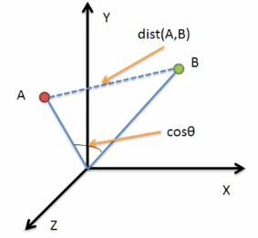

# 推荐系统

​	推荐系统是一个子类信息过滤系统，旨在根据目标角色过去的行为以及其他角色所做出的类似决策来构建模型，并使用该模型推荐具有相似属性的项目。当前推荐系统大多是组合了多种推荐算法的混合系统。

## 一、推荐系统目的

​	一个出色的推荐系统最终要实现的是用户、内容（目标项目）、使用推荐系统的平台三方共赢，而不，7777是成为资本家推送产品的帮凶。

1. 让用户更快速的获取到所需的目标内容
2. 让内容更快推送到具有特定偏好的用户中
3. 让使用推荐系统的平台更有效的保留用户资源

## 二、推荐算法

### 1、协同过滤（Collaborative Filtering）

​	协同过滤的理论基于一种假设：用户过去的决策与未来的决策不会发生变动，过去认同的属性在将来也会得到认同。推荐算法使用不同用户对目标项目的评级历史集来生成建议，通过在历史集中查找与当前用户有相似评级的用户，使用邻域（测试用户相似性与项目相似性如k-NN）生成推荐。

#### 分类

- 具于近邻的协同过滤
  - 基于用户（User-CF）
  - 基于物品（Item-CF）
- 给予模型的协同过滤
  - 奇异值分解（SVD）
  - 潜在语义分析（LSA）
  - 支撑向量机（SVM）

##### 基于临近的推荐

|      | 大香蕉 | 臭粑粑 | 泥猴桃 | 臭卤虾 | 小汉堡 |
| ---- | ------ | ------ | ------ | ------ | ------ |
| 老八 | 1      | 5      | 2      | 5      | 5      |
| 肥豪 | 5      | 1      |        | 2      | 2      |
| 郭一 | 2      | ？     | 3      | 5      | 4      |
| 房V  | 4      | 3      | 5      | 3      |        |

###### 基于用户的协同过滤

- 基于用户对物品的偏好发现口味相似的用户“邻居”群体
- 计算中采取类似knn获取k个临近用户根据临近用户的喜好对当前用户进行推荐
- User-CF与基于人口投机学推荐的差异在User-CF所需的数据是用户操作历史而不是用户本身特征
- 一般用于处理物品数量远大于用户数量的情况（新闻）

###### 基于物品的协同过滤

- 基于用户对物品的评价发现类似物品群体
- 计算方式与基于用户类似，筛选临近物品
- 一般用于处理用户数量远大于物品数量的情况（电影、音乐）

##### 基于模型的推荐

​	抽象出模型使用机器学习算法训练模型进行推荐，与基于统计学的区别在于模型的建立相当于在用户行为数据中提取用户和物品特征而无需提前知道用户特征。

​	特征分为显性特征（用户标签、物品分类标签）和隐性特征，显性特征可以直接匹配推荐，隐形特征则需要根据已有偏好通过隐语义模型（Latent Factor Model，LFM）发觉隐藏特征。

- 用户有一定特征决定选择偏好（郭一喜欢NTR）
- 物品有一定特征决定用户是否选择它（NTR的本子）
- 用户选择物品的原因是因为用户特征与物品特征匹配（郭一选择NTR本子）

#### 优点

- 不依赖于机器可分析内容
- 可以准确推荐复杂项目
- 无需了解被推荐项目本身属性

#### 缺点

- 对于历史集中未给出的新项目，没有足够数据来给出准确建议（冷启动）
- 若历史集项目和用户数量巨大，则每次推荐都需要大量的计算能力（可伸缩性）
- 大部分用户不会对全部项目进行评级，只会对一小部分项目进行评级（稀疏性）
- 很难顾及口味特殊的“重口味”用户的喜好

### 2、基于内容的过滤（Content-based Filtering）

​	基于内容的过滤使用项目属性和用户偏好通过机器学习的方法来进行推荐，一般适用于在项目有已知属性（名称、位置、描述等等）但用户没有已知数据的情况。基于内容的过滤最关键问题就是针对用户偏好的建模与通过抽取项目内在或外在的特征值，实现相似度计算。

#### 物品特征提取

- 物品特征打标签（tag）
  - 专家标签（PGC）
  - 用户自定义标签（UGC）
  - 降维分析数据，提取隐语义标签（LFM）
- 文本信息提取关键词
  - 分词、语义处理、情感分析（NLP）
  - 潜在语义分析（LSA）

#### 相似度计算

​	相似度的评判一般用距离表示，最常使用的是余弦相似度

- 欧式距离
  $$
  d(x,y)=\sqrt{\sum_i(x_i-y_i)^2}
  $$
  差向量模长

- 余弦相似度
  $$
  cos\theta = \frac{a·b}{||a||\times||b||} = \frac{\sum_{i}x_iy_i}{\sqrt{\sum_{i}x_i^2}\times\sqrt{\sum_{i}y_i^2}}
  $$
  两个向量的点积除以两个向量模长的乘积

#### 优点

- 只需要用户对特征属性的偏好，而不需要用户对项目的评价（可以分析新项目）
- 可以通过控制项目特征属性的维度来控制推荐精度

#### 缺点

- 物品属性最大纬度有限切提取属性困难
- 可分析内容有限，推荐内容僵化

### 3、多标准推荐系统（Multi-criteria recommender systems）

​	可以将多标准推荐系统（MCRS）定义为在多个标准上包含首选项信息的推荐系统。多标准推荐系统是基于对影响用户对项目总体偏好的多个标准来预测用户对新新项目的评级。

### 4、有风险意识的推荐系统（Risk-aware recommender systems）

​	有风险意识的推荐系统不止根据上下文信息而产出推荐内容，而且考虑了某些情况下产出推荐的风险。多采用DRARS，将上下文感知建通过[多臂老虎机算法](https://en.wikipedia.org/wiki/Multi-armed_bandit)进行建模。

### 5、移动推荐系统（Mobile recommender systems）

​	移动推荐系统通过可以访问互联网等我移动设备提供个性化推荐（如驾驶路线推荐）其需要处理的数据异构而嘈杂。一般存在四个关键因素：上下文、推荐方法、隐私和地方政策。

### 6、基于会话的推荐系统（Session-based recommender systems）

​	基于会话的推荐系统使用会话中与用户的交互，在无需用户行为历史记录的情况下，根据最近会话交互顺序使用例如递归神经网络之类的深度学习算法生成顺序模型。

### 7、强化学习推荐系统（Reinforcement learning for recommender systems）

​	强化学习推荐系统通过直接训练用户参与度对用户兴趣模型进行优化（如有奖调查💪👴👉爪巴）通过向被推荐对象提供奖励来学习模型或策略。

### 8、混合推荐系统（Hybrid recommender systems）

​	混合推荐系统是当前大多数推荐系统使用的方法，其主要策略是将协作过滤、基于内容过滤等和其他方法结合在一起，对不同技术进行杂交混合。

​	混合方法：

- 加权（Weighted）：将不同推荐成分加权进行组合
- 变换（Switching）：推荐时在不同推荐算法组件中进行切换
- 混合（Mixed）：将来自不同算法的结果混合显示给用户
- 特征组合（Feature Combination）：将不同知识来源的特征进行组合，提供给单个推荐算法
- 特征增强（Feature Augmentation）：将一种算法产生的附加的特征信息嵌入另一种推荐算法的特征输入中
- 级联（Cascade）：一个算法的结果作为另一个算法的输入
- 元级别（Meta-Ievel)）：用一种推荐方法产生的模型作为另一种推荐方法的输入

