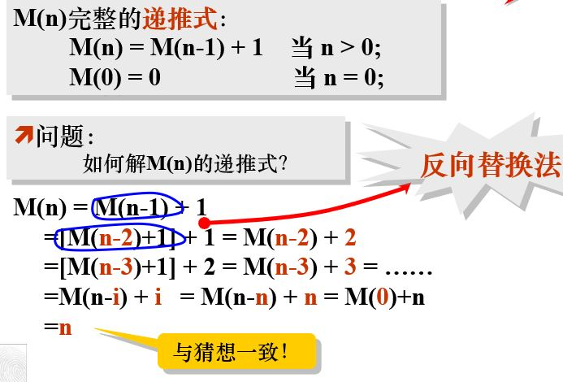
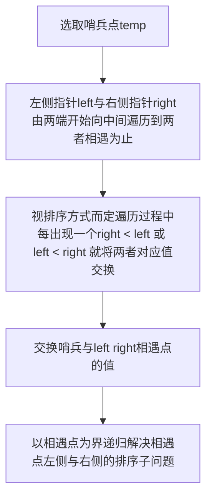
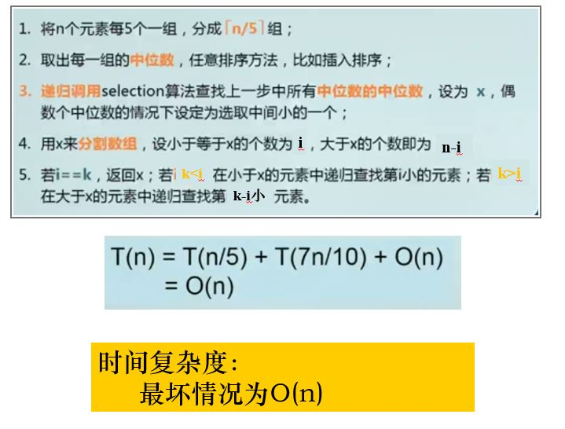
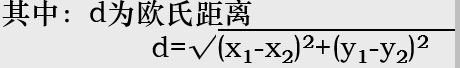

# 算法设计与分析

## 概论

### 基础理论

#### 什么是算法

算法是一些列解决问题的清晰指令，即对符合一定规范的输入，能够在有限时间内获得所要求的输出

**算法的性质**

- 输入：有0个或多个输入
- 输出：至少一个输出
- 确定性：每条指令清晰无歧义
- 有限性： 每条指令执行次数有限

#### 和程序的区别

程序是算法用某种程序设计语言的具体实现，可以不满足有限性（操作系统）

#### 算法分析的两个方面

- 时间复杂性分析
- 空间复杂性分析

### 应用

#### 算法复杂性分析

##### 代码段的时间复杂性

- 输入规模度量
- 运行时间度量
  - 使用秒、毫秒作为运行时间度量单位
    - 特定计算机困难
    - 计时困难
  - 计算每一步操作的执行次数
    - 记录困难
    - 没有必要
  - 基本操作执行次数

##### 时间效率的排序

$$
1 < n <\ nlog_2n<\ n^2<\ n^3<\ 2^n<\ n!
$$

算法的三种效率

- 最优效率
- 最差效率
- 平均效率

#### 三种渐进符号的定义及应用

- O： 渐进上界

  ①  O(f)+O(g)=O(max(f,g))

  ②  O(f)+O(g)=O(f+g)

  ③  O(f)O(g)=O(fg)

  ④  如果g(N)=O(f(N))，则O(f)+O(g)=O(f)

  ⑤  O(Cf(N))=O(f(N))，其中C是一个正的常数

  ⑥  f=O(f)

- $\Omega$：渐进下界

- $\Theta$：在范围内

#### 利用极限比较增长次数


#### 非递归算法的复杂性分析（输入规模、基本操作）

- 决定输入规模
- 找出基本操作
- 检测基本操作执行次数
- 建立执行次数的求和表达式
- 利用求和运算标准公式和法则求解 至少确定增长次数

#### 递归算法的复杂性分析

##### 递推式

设序列a0,a1,a2,…,an,…，简记为{an},若有一个等式将an与某些个ai(i<n)联系起来，那么就称该等式为关于序列{an}的递推式。

##### 递归式

递归式是递推式的一种

如自然数 $a_n=n$

递推式$a_{n+1}=a_n+1$

递归式$a_{n+2} = 2a_{n+1}-a_n$

##### 常用解题方法（反向替换法）

1. 将递推式中的X(n)表示为X(n-i)的函数；

2. 选择 i 的值，使n-i落入初始条件的定义域；

3. 用闭合公式表示

由的第一项开始向后推理

我们求得递推式：

X(n) = X(n-i)+((n-i+1)+…+n)

因为X(0) = 0, 所以 n-i = 0, i = n

故递推式的闭合公式：
     X(n) = X(n-n) + (1+…+n)=X(0)+n(n+1)/2
X(n) = n(n+1)/2 



## 分治

### 分治法的基本思想

将一个难以直接解决的大问题，分割成一些规模较小的相同问题，以便各个击破，分而治之。

特征

- 可以分为若干相同问题
- 子问题容易解决
- 子问题的解可以合并为原问题的解
- 子问题相互独立（不独立用dp）


### 分治算法设计模型

```c++
问题结果 solve(P){	// 分治函数
    if(达到可以运算的条件)
        运算;
    将现在的问题划分为K个子问题;
    for(int i = 0; i < k; i++){
     	子问题结果 = solve(第i个子问题); 	// 递归求解子问题
    	将子问题结果合并为当前问题结果
    }
    return 当前问题结果;
}
```


### 为什么引入平衡子问题

平衡子问题：将一个问题分为**大小相等**的K个子问题

引入的原因是因为经验得出它总是比子问题规模不等的做法好

### 分治法的算法复杂性分析

#### 递归式各项的含义

阶乘递归式
$$
n!= \left\{ \begin{aligned} 1  \ \ \ \ n=0 \\  n(n-1)\ \ \ \ n > 0\end{aligned} \right.\\
$$


#### Master定理

$$
T(n)= \left\{ \begin{aligned} O(1)  \ \ \ \ n=1 \\ kT(\frac nm)+f(n)\ \ \ \ \ n > 1\end{aligned} \right.\\
通过迭代方程求得方程的解：
\\
T(n)= n^{log_mk}+\sum {log_mn-1 \atop j=0} k^jf(\frac{n}{m^j})
$$

求解$T(n)=aT(\frac nb)+f(n)$使用$f(n)与n^{log_ba}比较$

- 若$n^{log_ba}大，则T(n)=\theta(n^{log_ba})$
- 若f(n)大，则$T(n)=\theta(f(n))$
- 若同阶，则$T(n)=\theta(n^{log_ba}logn)=\theta(f(n)logn)$

无法应用情况（非多项式大于或小于）

求解$T(n)=2T(n/2)+nlogn$的渐进式
$$
a = 2, b = 2\\
n^{log_ba} = n^{log_22} = n\\
f(n)=nlogn\\
n^{log_ba}非多项式小于f(n)，不能使用master定理\\
推导法:\\
T(n) = 2T(\frac n2)+nlogn\\
= 2^{2}T(\frac n {2^2}) + nlog(\frac n2) + nlogn\\
= 2^{logn}T(1) + nlog1+...+nlog(\frac n2) + nlogn\\
= n + nlog1 + ... + nlog(\frac n2) + nlogn\\
= O(nlognlogn)
$$

### 应用题目

#### 大整数乘法、矩阵相乘的时间复杂度分析

- 大数乘法 $X\times Y$

  将每个大数等分为两份

  

  $X\times Y = (A\times10^{\frac n2} + B)(C\times10^{\frac n2} + D)$

  $ = A\times C \times 10^n + (AD + BC)\times 10^{\frac n2} + B \times D$

  产生四个子问题 $A\times C、A \times D、B\times C、B\times D$

  继续化简

  $= A\times C\times 10^n + ((A+B)(A+C) - A\times C - B\times D)10^{\frac n2}+B\times D$

  只产生三个子问题

  递归式：

  $T(n)= \left \{ \begin{aligned}\theta(1) \ \ \ \ n = 1\\3T(\frac n2)+n\ \ \ \ n > 1 \end{aligned}  \right.$

  master定理求解

  a = 3 b = 2

  $n^{log3} > n$

  $O(n^{log_3})$

  ```c++
  /******************************************************
  * ClassName:BigNum
  * Description: 存储大数
  * Parameter:
  * 	@num	大数具体值（为了方便运算采取低位在前的存储方式）
  * 	@len	大数位数
  * 	@BigNum	无参构造，将其初始化为0
  ******************************************************/
  struct BigNum{
      int num[maxn];
      int len;
      BigNum(){
          memset(num, 0, sizeof(num));
          len = 0;
      }
  };
  /******************************************************
  * FunctionName: rmZero
  * Description: 在传入大数前方去除0
  * Parameter:
  * 	@a	要去除0的大数
  ******************************************************/
  void rmZero(BigNum &a) {
      while(a.len - 1 >= 1 && a.num[a.len - 1] == 0)
          a.len--;//去除最高位的0
  }
  /******************************************************
  * FunctionName: addAfterZero
  * Description: 在传入大数后方添加0
  * Parameter:
  * 	@a	要添加0的大数
  *   @l  要添加0的数量
  * Return:
  *   返回添加0后的BigNum
  ******************************************************/
  BigNum addAfterZero(BigNum a, int l) {
      int tmp[maxn];
      BigNum res;
      for(int i = 0; i < l; i++) {
          tmp[i] = 0;
      }
      memcpy(res.num, tmp, sizeof(tmp));
      memcpy(res.num + l, a.num, sizeof(a.num));
      res.len = l + a.len;
      return res;
  }
  /******************************************************
  * FunctionName: addBeforeZero
  * Description: 在传入大数前方添加0
  * Parameter:
  * 	@a	要添加0的大数
  *   @l  要添加0的数量
  * Return:
  *   返回添加0后的BigNum
  ******************************************************/
  BigNum addBeforeZero(BigNum a, int l) {
      int tmp[maxn];
      BigNum res;
      for(int i = 0; i < l; i++) {
          tmp[i] = 0;
      }
      memcpy(res.num, a.num, sizeof(a.num));
      memcpy(res.num + a.len, tmp, sizeof(tmp));
      res.len = l + a.len;
      return res;
  }
  /******************************************************
  * FunctionName: subBigNum
  * Description: 大数截取
  * Parameter:
  * 	@a	要被截取的大数
  *   @bg 开始截取的位置
  *   @l  截取的长度
  * Return:
  *   返回截取后的BigNum
  ******************************************************/
  BigNum subBigNum(BigNum a, int bg, int l) {
      BigNum res;
      res.len = l;
      int tmp = l-1;
      for(int i = a.len - bg; i > a.len - bg - l; i--){
          //cout << "i:" << i << " a.num[i]:" << a.num[i] << endl;
          res.num[tmp--] = a.num[i];
      }
      return res;
  }
  
  /******************************************************
  * FunctionName: multi_2
  * Description: 大数乘法（分治）
  * Parameter:
  * 	@a	乘数1
  *   @b  乘数2
  * Return:
  *   返回相乘后的BigNum
  ******************************************************/
  BigNum multi_2(BigNum a, BigNum b){
      BigNum c;
      int n = 2; // 计算当前大数长度
      if(a.len > 2 || b.len > 2) {
          n = 4;
          while(n < a.len || n < b.len)	// n一直乘二直到n大于两数中较长者的长度
              n <<= 1;
          // 在大数前方补零直至两者长度都为n
          a = addBeforeZero(a, n - a.len);	
          b = addBeforeZero(b, n - b.len);
      }
      // 长度为一则证明当前n依旧为2 将两数长度补至二
      if(a.len == 1)  a = addBeforeZero(a, 1);
      if(b.len == 1)  b = addBeforeZero(b, 1);
      if(n == 2){	// 当前长度为2
          int inta = 0, intb = 0;
          for(int i = a.len - 1; i >= 0; i--){ // 用inta记录第一个数
              inta += a.num[i];
              if(i != 0){
                  inta *= 10;
              }
          }
          for(int i = b.len - 1; i >= 0; i--){ // 用intb记录第二个数
              intb += b.num[i];
              if(i != 0){
                  intb *= 10;
              }
          }
          int inttmp = inta * intb;	// 两数相乘
          string tmp;	// 将整数转为字符串 当然如果环境支持c11以上也可以直接使用std::itos
          stringstream sst;
          sst << inttmp;
          sst >> tmp;
          c = change(tmp); // 将当前两数乘积转为大数c
          return c;	// 返回大数c
      }else{ // 长度大于二
          BigNum a0, a1, b0, b1, c0, c1, c2;
          a1 = subBigNum(a, 1, (n/2)); // a1为大数a的后半部分（我上方大数类中为了方便运算逆序存储）
          a0 = subBigNum(a, (n/2+1), a.len - (n/2) );// a0为大数a的前半部分
          // b0 b1同理
          b1 = subBigNum(b, 1, (n/2));
          b0 = subBigNum(b, (n/2+1), b.len - (n/2));
          c2 = multi_2(a1, b1); 
          c0 = multi_2(a0, b0);
          c1 = sub(multi_2(add(a0,a1),add(b0,b1)),add(c2, c0));
          c2 = addAfterZero(c2, n);
          c1 = addAfterZero(c1, n / 2);
          c = add(add(c2, c1), c0);
      }
      return c;
  ```

- 矩阵乘法

  n$\times$n的矩阵A和B的乘积矩阵C中的元素C\[i][j]

  $C[i][j]=\sum{n \atop k=1}A[i][k]B[k][j]$

  将A B C三个矩阵都分为上下左右四块
  $$
  [ \begin{aligned}C_{11} \ C_{12}\\C_{21}\ C_{22}  \end{aligned}] = [ \begin{aligned}A_{11} \ B_{12}\\A_{21}\ A_{22}  \end{aligned}][ \begin{aligned}B_{11} \ B_{12}\\B_{21}\ B_{22}  \end{aligned}]\\
  C_{11}=A_{11}B_{11} + A_{12}B_{12}\\
  C_{12}=A_{11}B_{12} + A_{12}B_{22}\\
  C_{11}=A_{21}B_{11} + A_{22}B_{21}\\
  C_{11}=A_{21}B_{12} + A_{22}B_{22}
  $$
  分治法最终可以将问题转换为7个矩阵连乘小问题
  $$
  M_1 = A_{11}(B_{12}-B_{22})\\
  M_2 = (A_{11} + A_{12})B_{22}\\
  M_3 = (A_{21} + A_{22})B_{11}\\
  M_4 = A_{22}(B_{21} - B_{11})\\
  M_5 = (A_{11}+A_{22})(B_{11} + B_{22})\\
  M_6 = (A_{12}+A_{22})(B_{21} + B_{22})\\
  M_7 = (A_{11}+A_{21})(B_{11} + B_{12})
  $$
  时间复杂度分析
  $$
  T(n) = \left \{ \begin{aligned} O(1)\ \ \ \ n = 2\\7T(\frac n2) + O(n^2)\ \ \ \ n > 2\end{aligned} \right.
  $$
  由master定理计算

  a = 7 b = 2

  $n^{log7} > n^2$

  所以复杂度为$n^{log7}$

#### 排序问题

##### 快速排序思想

##### 快排的一趟实现过程




##### 快排的时间复杂度分析（最好、最坏）

- 最坏情况

  对应排序数组以基本有序（所有分裂点都为极端情况），若不考虑随机主元的情况，每次只能走进一个子问题中，哨兵以每次递归一个单位的速度移动

  时间复杂度

  $T(n)=\left \{ \begin{aligned} O(1) \ \ \ \ n <= 1 \\ T(n-1) + n \ \ \ \ n>1\end{aligned} \right.$

  $O(n^2)$

- 最好情况 

  所有分裂点都位于相应子数组的中点

  $T(n) = \left \{ \begin{aligned} O(1) \ \ \ \ n <= 1 \\ 2T(\frac n2) + n \ \ \ \ n > 1 \end{aligned} \right.$

  $a = 2 \ b = 2 \ f(n) = n$

  $n^{log2} = n = f(n)$

  $O(nlogn)$

##### 算法实现

```c++
/********************************************************************************
* @File: 快速排序
* @Author: suvvm
* @blog: www.suvvm.work
* @github: https://github.com/suvvm
* @email: suvvm@foxmail.com
* @Version: 1.0.2
* @Date: 2019-11-15
********************************************************************************/
#include<bits/stdc++.h>
using namespace std;
int a[100001],n;
void exchange(int &a,int &b)
{
    int temp;
    temp = a;
    a = b;
    b = temp;
}

/*
void quicksort(int left,int right) // 非随机主元
{
	int i,j,t,temp;
	if(left>right)
	return;
	
	temp=a[left];
	i=left;
	j=right;
	while(i!=j)
	{
		while(a[j]>=temp&&i<j)
		j--;
		while(a[i]<=temp&&i<j)
		i++;
		
		if(i<j)
		{
			t=a[i];
			a[i]=a[j];
			a[j]=t;
		}
	}
	a[left]=a[i];
	a[i]=temp;
	
	quicksort(left,i-1);
	quicksort(i+1,right);
	
}
*/

void quicksort(int left,int right)
{
    srand((unsigned)time( NULL));
	if(left < right) {
        int temp;
        int i = left - 1;
        //产生随机数组下标
        int k = left + rand()%(right - left + 1);
        //仍然将随机的枢轴交换到最后
        exchange(a[right],a[k]);
        temp=a[right];

        for(int j= left; j <= right - 1; j++)
        {
            if(a[j]<=temp)
            {
                i = i+1;
                exchange(a[i], a[j]);
            }
        }
        //最后主元交换
        exchange(a[i + 1],a[right]);
        int r = i + 1;
        quicksort(left, r - 1);
        quicksort(r+1, right);
	}
}

int main()
{
	int i,j,t;
	scanf("%d",&n);
	for(i=1;i<=n;i++)
		scanf("%d",&a[i]);
	quicksort(1,n);
	for(i=1;i<=n;i++)
		printf("%d ",a[i]);
    system("pause");
    return 0;
}

```


#### 线性选择问题

##### 什么是选择（线性选择）问题

给定线性序集中n个元素要求选择给定条件的某个元素。

##### 线性选择问题的步骤

1. 列出约束条件确定可行域
2. 排序
3. 求解

##### 中位数的中位数作用？

中位数是一个非常重要的统计量，可以避免最大值最小值的干扰。例如：海量数据中统计中间工资、中间年龄等 

##### 算法效率

与所选排序算法有关

线性时间选择最坏O(n)



#### 最接近点对问题

##### 什么是最接近点对问题

给定平面上n个点（xi，yi）（1≤i≤n），要求找出其中的一对点，使得在 n 个点组成的所有点对中，该点对间的距离d最小



##### 利用分治法解题的过程

- 将点集分成大致相等的两部分$S_1 S_2$
- 递归分别求解$S_1 S_2$中的最近对的值$d_1 d_2$
- 求出一点在$S_1$中另一点在$S_2$中的最近点对$d_{pq}$
- 原问题的解$d=min\{d_1, d_2, d_{pq}\}$

###### 二维

所有点按x坐标排序，找到第$\frac n2$个点作垂直直线l，把n个点分为$S_1 \ S_2$两个子集之后递归便可求得一个临时最短距离$d = min\{d_1,d_2\}$ 再考虑$d_{pq}$ 若在$S_1$中选取p 将会出现以下情况


之后将所有点按x由小到大 y由小到大进行预处理

对于在l左边$S_1$中d范围内的每个点检测对于右侧$S_2$中检测d范围内的点求出最小值。

##### 鸽笼定理的作用体现在哪儿

根据鸽笼定理可以确定上述d$\times$2d的矩形中最多只能有6个对应候选点

因为将d$\times$2d的矩形长三等分宽二等分 可以得出6个$\frac d2 \times \frac {2\times d}3$的矩形

若超过6个候选点，必定有一个矩形中会有2个以上的候选点 在同一矩形内的候选点之间距离必定小于d，与我们之前所求产生了冲突，所以最多只有6个候选点。

##### 算法效率

时间复杂度分析

$T(n) = \left \{ \begin{aligned} O(1) \ \ \ \ n<4 \\ 2T(\frac n2)+O(n) \ \ \ \ n>=4 \end{aligned} \right.$

$a = 2 \ b = 2$

$n^{log_22} = n = n$

时间复杂度$ O(nlogn)$

## 动态规划

### 动态规划的基本思想

将待求子问题分解成若干子问题，先求解子问题再结合这些子问题的解得到原问题的解。

备忘录思想 当dp[i]的值被计算后，保存它的值，当再次计算dp[i]时只需要从表中取出即可。

#### 与分治法的相同点与不同点

##### DP与分治的相同点

- 都把原问题分为子问题来求解

- 都存在递推关系

##### DP与分治的不同点

- 子问题不独立时如果用分治法求解相同问题，子问题数目太多，且计算量大——指数级
- 在DP中通常用表记录子问题的解，以便保存方便以后的计算，DP由最简单的问题开始填起自底向上填表，最终得到原问题答案，保证了在求解一个子问题时，所有与子问题的子问题都已经得到计算并可以在表中查到。

#### 两个重要性质/基本要素

- 最优子结构

  一个问题的最优解包含在子问题的最优解

  - 最优子结构保证了DP的正确性
  - 最优子结构帮助缩小了子问题规模，只需最优问题中包含的子问题，避免了无用子问题的计算
  - 最优子结构使得我们能自底向上地完成求解过程，下面计算的结果上面一定能用到

- 重叠子问题

  在问题求解过程中，很多子问题的解将被多次使用，DP能加速问题的求解效果

#### 解题的步骤

- 刻画最优子结构(确定是否能用DP做 最优子结构 + 重叠子问题)
- 递归定义最优解的值
- 自底向上计算原问题最优解
- 根据计算最优值时得到的信息构造最优解

### 应用题目

#### 矩阵连乘问题

给定n个可乘的数字矩阵 $A_1, A_2,..., A_n $，矩阵 $A_i $ 的规模为 $p_{i-1}\times p_i $ 求给定矩阵连乘的最优计算次序，使得计算乘积 $A_1\times A_2 \times ... \times A_n $ 所需执行的数乘次数最少.

##### 解题过程/填表过程

假设 $A_1\times A_2 \times ... \times A_n$ 的最优计算次序会在$A_k$时断开（只是打个比方，就像上方图计算 $A_1 \times A_2 \times A_3 \times A_4$ 时在 $A_1$ 处断开成为 $A_1与A_2 \times (A_3\times A_4)$ 一样）这时对最优计算次序的计算也会断开成为两个子问题 
$$
\left\{ \begin{aligned} 子问题1 & = & 求A_1\times A_2 \times ... \times A_k 的最优计算次序\\ 子问题2 & = & 求A_{k+1}\times A_{k+2} \times ... \times A_n 的最优计算次序\end{aligned} \right. 
$$

而子问题解决后会得到两个矩阵，若想得到原问题最优解则需要加上两子问题矩阵相乘所需的乘法次数。

**最优子结构性质**

假设n个矩阵 $ A_1\times A_2 \times ... \times A_n $ 连乘的最优加括号方案为(solve(1~k))(solve(k+1~n))则solve(1~k)肯定为子问题 $A_1 \times A_2 \times A_k $ 的最优解，solve(k+1~n)肯定为子问题 $ A_k \times A_{k+1} \times A_n $ 的最优解

P数组：矩阵维度 由于矩阵乘法中前一矩阵的列数等于后一矩阵的行数所以如果P[i]代表第i矩阵的行数，它还可以代表第i + 1矩阵的列数。

子问题矩阵相乘所需的乘法次数 = 子问题1矩阵的行数（A1的行数） $\times$ 子问题2矩阵的列数（An的列数） $\times$ 计算结果矩阵一个元素所需的乘法次数（Ak+1的行数 或Ak的列数）

状态转移方程
$$
dp[i][j]=\left\{ \begin{aligned} 0(i = j )\\ dp[i][k]+dp[k+1][j]+p_{i-1} \times p_j \times p_k(i < j)\end{aligned} \right.
$$

**自低向上的计算方式**

- dp初始状态：一个矩阵相乘dp\[i]\[i]=0

- 计算所有两矩阵 $A_i \times A_{i+1}$ 相乘的最优值dp\[i][i+1]

- 按矩阵链长增长，依次计算：

  3个矩阵相乘

  4个矩阵相乘

  ...

  n个矩阵相乘

填表方式

$(x,y) = min_{x <= k < y}((x,k) + (k+1,y)+P_{x-1}P_kP_y)$

填表习题

计算矩阵连乘乘积最少乘法次数 $A_1 \times A_2 \times A_3 \times A_4 \times A_5 \times A_6$ 

维度


| A1           | A2           | A3          | A4          | A5           | A6           |
| ------------ | ------------ | ----------- | ----------- | ------------ | ------------ |
| 30$\times$35 | 35$\times$15 | 15$\times$5 | 5$\times$10 | 10$\times$20 | 20$\times$25 |

P数组 = [30, 35, 15, 5, 10, 20, 25]


|       | 1    | 2     | 3          | 4           | 5             | 6              |
| ----- | ---- | ----- | ---------- | ----------- | ------------- | -------------- |
| **1** | 0    | 15750‬ | 7875(1 23) | 9375(123 4)‬ | 11875‬(123 45) | 15125(123 456)‬ |
| **2** |      | 0     | 2625       | 4375(23 4)  | 7125(23 45)   | 10500(23 456)  |
| **3** |      |       | 0          | 750         | 2500(3 45)    | 5375(3 456)    |
| **4** |      |       |            | 0           | 1000          | 3500(45 6)     |
| **5** |      |       |            |             | 0             | 5000           |
| **6** |      |       |            |             |               | 0              |


##### 如何还原最优解/加括号过程的最终方案

使用s\[i][j]记录矩阵i到j连乘最优断开点

假设s\[i][j] = k 表明i到j连乘在k处分开，分为 i到k 与 k+1到j

之后去查询s\[i][k]与s\[k+1][j] 以此递推，自顶向下构造完全加括号方式

##### 代码

```c++
/********************************************************************************
* @File: 矩阵连乘问题
* @Author: suvvm
* @blog: www.suvvm.work
* @github: https://github.com/suvvm
* @email: suvvm@foxmail.com
* @Version: 1.0.1
* @Date: 2019-11-27
********************************************************************************/
#include <bits/stdc++.h>
using namespace std;
const int MAXN = 1e4+10;
// m[i][j]保存i到j的最小乘法次数 s[i][j]保存i到j的断点
int p[MAXN];
int minN[MAXN][MAXN];
int s[MAXN][MAXN];
int n;

void solve() {
    for(int len = 2; len <= n; len++) {   // 遍历连乘长度
        for(int i = 1; i <= n - len + 1; i++) {	// 遍历起点
            int j = i + len - 1;
            // 直接计算所需次数
            minN[i][j] = minN[i + 1][j] + p[i - 1] * p[i] * p[j];
            s[i][j] = i;
            for(int k = i + 1; k < j; k++) { // 遍历断点k
                int tCnt = minN[i][k] + minN[k+1][j] + p[i-1] * p[k] * p[j]; // 状态转移方程
                if(tCnt < minN[i][j]) {    // 乘法次数可被优化
                    minN[i][j] = tCnt;
                    s[i][j] = k;	// 更新i到j的断点记录
                }
            }
        }
    }
}
void print(int i,int j)
{
	if(i == j) {
		cout <<"A" << i;
		return;
	}
	cout << "(";
	print(i , s[i][j]);
	print(s[i][j] + 1, j);
	cout << ")";
}
int main()
{
    int m;
    cout << "输入m:";
    cin >> m;
    while(m--) {
        cout << "输入n:";
        cin >> n;
        cout << "输入矩阵对应行数与最后矩阵的列数:" << endl;
        for(int i = 0; i < n + 1; i ++) {
            cin >> p[i];
        }
        solve();
        cout << endl << "最小次数:" << minN[1][n] << endl;
        print(1,n);

    }
    return 0;
}
```

#### 0/1背包问题

##### 解题过程

- 证明最优子结构

- 构造递归方程

- 计算最优值

  边界条件没有物品或背包容量为空价值为0

  由只考虑装或不装第一个物品开始自底向上依次计算

##### 理解递归式的定义、填表过程

考虑是否能装进去，装不进去不装，装的进去可以装也可以不装，取最大价值。

设i为当前物品 j为当前背包剩余可用容量

$dp[i][p] = \left \{ \begin{aligned} dp[i-1][j]\ \ \ \ 0 <= j <volume[i] \\ max\{dp[i-1][j],d[i-1][j-volume[i-1]] + value[i]\}\ \ \ \ j>=volume[i] \end{aligned} \right.$

因为自底向上运算，每次只需要用到上次运算的结果，所以可用使用滚筒数组来优化空间复杂度

$dp[i][p] = \left \{ \begin{aligned} dp[j]\ \ \ \ 0 <= j <volume[i] \\ max\{dp[j],d[j-volume[i-1]] + value[i]\}\ \ \ \ j>=volume[i] \end{aligned} \right.$

填表过程以二维数组为例


| 物品 | 1    | 2    | 3    | 4    |
| ---- | ---- | ---- | ---- | ---- |
| 体积 | 2    | 1    | 3    | 2    |
| 价值 | 12   | 10   | 20   | 15   |

背包容积为5


| 物品\背包容量 | 0    | 1    | 2    | 3    | 4    | 5    |
| ------------- | ---- | ---- | ---- | ---- | ---- | ---- |
| 0             | 0    | 0    | 0    | 0    | 0    | 0    |
| 1             | 0    | 0    | 12   | 12   | 12   | 12   |
| 2             | 0    | 10   | 12   | 22   | 22   | 22   |
| 3             | 0    | 10   | 12   | 22   | 30   | 32   |
| 4             | 0    | 10   | 15   | 25   | 30   | 37   |


##### 算法实现

```c++
#include <bits/stdc++.h>
using namespace std;
const int maxn = 1e3+100;
int value[maxn], volume[maxn];
//value记录物品价值volume记录物品体积
int dp[maxn];
int main()
{
    int t;  //测试数量
    while(scanf("%d", &t) != EOF){
        int n, v;   //n为物品数量 v背包容量
        while(t--){
            scanf("%d%d", &n, &v);
            for(int i = 1; i <= n; i++){
                scanf("%d", &value[i]); //输入物品价值
            }
            for(int i = 1; i <= n; i++){
                scanf("%d", &volume[i]);    //输入物品体积
            }
            memset(dp, 0, sizeof(dp));  //初始化边界
            for(int i = 0; i <= n; i++){    //枚举物品
                for(int j = v; j >= volume[i]; j--){  //逆序枚举体积
                    dp[j] = max(dp[j], dp[j - volume[i]] + value[i]);
                }
            }
            int ans = 0;
            for(int i = 0; i <= v; i++){    //找到最大值
                ans = max(ans, dp[i]);
            }
            printf("%d\n", ans);    //输出答案
        }
    }
    return 0;
}

```

##### 时间复杂度分析

n种物品，背包体积v

O(nv)

#### 最长公共子序列问题LCS

##### 定义

Z=CGCA是X=ACGCTAC 和 Y=CTGACA 最长公共的子序列

##### 三种情况的分析

**最优子结构证明**

假设$Z_k = <z_1,z_2,z_3..,z_k>$是$X_m=<x_!,x_2,...,x_m>$和$Y_n=<y_1,y_2,...y_n>$的任意$LCS_{xy}$（最优解），那么如下结论成立

- 假如$x_m = y_n$，那么$z_k = x_m = y_n$ ，并且$Z_{k-1}$是$X_{m-1}$与$Y_{n-1}$的$LCS_{x_{m-1}Y_{n-1}}$（最优解）

  $LCS_{XY} = LCS_{X_{m-1}Y_{n-1}} + x_m或y_n$

- 假如$x_m \neq y_n$，并且$z_k \neq x_m$，则有$Z_k$是$X_{m-1}$与$Y_n$的$LCS_{X_{m-1}Y_n} = LCS_{XY}$

- 假如$x_m \neq y_n$，并且$z_k \neq y_n$，则有$Z_k$是$X_m$与$Y_{n-1}$的$LCS_{XY_{n-1}} = LCS_{XY}$

所以最长公共子序列问题具有最优子结构

根据上述分析可以列出状态转移方程

$dp[i][j] = \left \{ \begin{aligned}0 \ \ \ \ if\ i=0,or \ j = 0 \\ dp[i-1][j-1] + 1 \ \ \ \ if \ i,j>0\ and\ x_i = y_i \\ max\{dp[i-1][j],d[i][j-1]\}\ \ \ \ if\ i,j>0\ and \ x_i \neq y_j \end{aligned} \right.$

##### DP实现方法

任何i与j组合都会产生一个子问题。自底向上求解子问题的公共子序列长度，将其保存到$dp[i][j]$中

- 初始化i为0或j为0的情况最长公共子序列长度为0($dp[i][0] = 0\ \ dp[0][j] = 0$)
- 求解i = 1时与所有$Y_j$的最长公共子序列长度$dp[1][j]$
- 求解i = 2时与所有$Y_j$的最长公共子序列长度$dp[2][j]$
- ...
- 求解i = m时与所有$Y_j$的最长公共子序列长度$dp[m][j]$

记录公共子序列信息

使用pre数组记录前驱即可。

##### 算法实现

```c++
#include <bits/stdc++.h>
using namespace std;
const int maxn = 1e4 + 100;
string tstr1, tstr2, str1, str2;
//我们需要的字符串下标从1开始，所以先用tstr1 与 tstr2记录用户输入
//str1 str2为需要参与运算的字符串
int dp[maxn][maxn];
int pre[maxn][maxn];
int main()
{
    while(cin >> tstr1){
        str1 = str2 = "";   //每次计算开始前使str1 str2为空
        cin >> tstr2;
        str1 += "*";    //为了方便运算str1首位随便加一个字符
        str1 += tstr1;  //将先前记录的tstr1加入str1末尾
        str2 += "0";    //str2与str1操作相同
        str2 += tstr2;
        int len1 = str1.size() - 1; //获取str1有效位长度（第一位没用）
        int len2 = str2.size() - 1; //获取str2有效位长度（第一位没用）
        //初始化dp数组的边界值
        //这里不能用memset，如果使用的话会超内存
        for(int i = 0; i <= len1; i++){
            dp[i][0] = 0;
        }
        for(int i = 0; i <= len2; i++){
            dp[0][i] = 0;
        }
        //遍历所有情况
        for(int i = 1; i <= len1; i++){
            for(int j = 1; j <= len2; j++){
                if(str1[i] == str2[j])
                    dp[i][j] = dp[i - 1][j - 1] + 1, pre[i][j] = 1;
                else if(str1[i] != str2[j]){
                    dp[i][j] = max(dp[i - 1][j], dp[i][j - 1]);
                    if(dp[i - 1][j] >= dp[i][j - 1])
                        pre[i][j] = 2;
                    else
                        pre[i][j] = 3;
                }
            }
        }
        printf("%d\n", dp[len1][len2]);
        string lcs = "";
        int i = len1, j = len2;
        while(i >= 0 && j >= 0){
            if(pre[i][j] == 1){
                lcs += str1[i];
                i--, j--;
            }else if(pre[i][j] == 2){
                i--;
            } else {
                j--;
            }
        }
        reverse(lcs.begin(), lcs.end());
        cout << lcs;
    }
    return 0;
}

```

##### 时间复杂度分析

计算最优时间 i j层循环，i 循环m步，j循环n步共需O(mn)

#### 数字三角形问题

 $val[i][j]$代表第i行第j个数

这道题有自顶向下和自底向上两种算法，其各有优点

先说自顶向下，$dp[i][j]$表示从顶点走到当前点的最大权值和，将dp初始化为0，可以发现每行第一个点只能由其上一行第一个点抵达，每行最后点只能由其上层最后点抵达，根据这两条设置dp的初始状态，自顶向下计算最大值    状态转移方程：  $dp[i][j] = std::max(dp[i - 1][j - 1],dp[i - 1][j]) + val[i][j];$    

再说自底向上原理，dp代表当前点到底的最大权值和，从$val[i][j]$出发，下一步只能走$val[i+1][j]$或者$val[i+1][j+1]$,如果走$val[i+1][j]$则$dp[i][j] = dp[i+1][j] + val[i][j]$,如果走$val[i+1][j+1]$ 则 $dp[i][j] = dp[i+1][j+1]+val[i][j]$  状态转移方程$dp[i][j] = max(dp[i + 1][j],  dp[i + 1][j + 1]) + val[i][j]$  

##### 自顶向下

```c++
#include <bits/stdc++.h>
// using namespace std;
// 拒绝命名空间污染，养成不用std命名空间的好习惯
const int MAXN = 1e4+10;
int val[MAXN][MAXN];
int dp[MAXN][MAXN];

void dpInit(int n) {
    dp[0][0] = val[0][0];
    for(int i = 1; i < n; i++)  // 初始化到每层第一个位置最大值
        dp[i][0] = dp[i - 1][0] + val[i][0];    // 每层第一个位置只能由上一次第一个位置到达
    for(int i = 1; i < n; i++)  // 初始化到每层最后位置的最大值
        dp[i][i] = dp[i - 1][i - 1] + val[i][i];    // 每层最后位置只能由上一层最后位置抵达
}
int main()
{
    int n;
    std::cin>> n; // 层数n
    // 输入数字金字塔并初始化dp
    memset(dp, 0, sizeof(dp));
    for(int i = 0; i < n; i++){
        for(int j = 0; j < i + 1; j++){
            std::cin >> val[i][j];
        }
    }
    dpInit(n);

    // 自顶向下计算最大值
    for(int i = 1; i < n; i++){
        for(int j = 1; j < i; j++){
            dp[i][j] = std::max(dp[i - 1][j - 1],dp[i - 1][j]) + val[i][j];
        }
    }

    int maxNum = 0;
    for(int j = 0;j < n;j++)
        maxNum = std::max(dp[n-1][j], maxNum);
    std::cout<< maxNum << std::endl;
    return 0;
}
```

##### 自底向上

```c++
#include <bits/stdc++.h>
// using namespace std;
// 拒绝命名空间污染，养成不用std命名空间的好习惯
const int MAXN = 1e4+10;
int val[MAXN][MAXN];
int dp[MAXN][MAXN];

int solve(int i,int j,int n)
{
    if(dp[i][j] != -1)
        return dp[i][j];
    if(i == n)
        dp[i][j] = val[i][j];
    else
        dp[i][j] = std::max(solve(i + 1, j, n), solve(i + 1, j + 1, n)) + val[i][j];
    return dp[i][j];
}
int main()
{
    int n;
    std::cin>> n; // 层数n
    // 输入数字金字塔并初始化dp
    memset(dp, -1, sizeof(dp));
    for(int i = 0; i < n; i++){
       
        for(int j = 0; j < i + 1; j++){
            std::cin >> val[i][j];
        }
    }
    solve(0, 0, n);
    // 自底向上dp数组的意义就是当前点的最大和
    std::cout << dp[0][0] << std::endl;
    return 0;
}
```

##### 时间复杂度

$O(n^2)$

## 贪心

做出在当前看来最好的选择，不从全局最优考虑，做出的选择是局部最优

### 贪心算法的基本思想

最终目标是解决优化问题，算法的每个步骤都面临一组选择，要做出**贪心选择**——当前状态下的局部最优选择

贪心算法能否产生最优解需要严格证明

#### 两个重要性质 要素

- 贪心选择性

  贪心选择性是贪心算法可行的第一基本要素，也是贪心算法与动态规划的主要区别

  - 动态规划通过自底向上解决子问题，贪心算法自顶向下做出贪心选择
  - 对于每一个具体问题都要确定它是否具有贪心选择性

- 最优子结构

  最优解包含子问题的最优解，于DP有同（概念相同）有异（构造方法有异）

#### 贪心选择性最常用证明

- 数学归纳法

  根据前几步推理，对于任何正整数k，贪心算法的前k步都导致最优解

- 交换论证法

  给定任意一个最优解，根据贪心准则进行改造（用第一步贪心选择的对象替换最优解中的特定元素），证明替换后的新解也是最优解

  之后证明上述交换过程可以循环进行

#### 具体问题的贪心策略

- 哈夫曼编码：次数最大优先
- 最优装载：重量最小优先
- 如小数背包：单位价值率最大优先
- Dijkstra：距离最短优先
- 克鲁斯卡尔（Kruskal）：边权最短优先
- Prim：距离点集最近优先

## 回溯

### 回溯算法的基本思想

#### 搜索的机制 剪枝函数与作用

**搜索的机制**：深度优先搜索

**剪枝函数**：约束函数、限界函数用于减去无效分枝加速达到目标 

#### 解空间树的两种形式、叶子结点个数

##### 子集树

所给问题时从n个元素的集合S中找出某种性质的子集

叶子节点个数：$k^n$（每一步都有k种选择，一共走n步）个

算法模板

```c++
void solve(int t){	// t为当前递归深度
    if(t > n)	// 递归深度大于元素个数
        output(x);	// 显示当前答案
    else{
        for(int i = 1; i <= n; i++){
            x[t] = h[i];
            if(C(t) && B(t)){	// 符合剪枝条件
                solve(t+1);	// 递归解决下个深度
            }
        }
    }
}
```


##### 排列树

所给问题是确定n个元素满足某种性质的排列

叶子节点个数：n!（第一步n种选择第二步n-1种选择……走后一步只有1种选择）

算法模板

```c++
void solve(int t){
    if(t > n)	// 递归深度大于元素个数
        output(x);	// 显示当前答案
    else{
        for(int i = 1; i <= n; i++){
            if(C(t) && B(t)){	// 符合剪枝条件
                swap(x[t],h(i));
                solve(t+1);	// 递归解决下个深度
                swap(x[t],h(i));	// 回溯还原
            }
        }
    }
}
```


#### 回溯算法的特点

- 系统性：在包含所有解的解空间中按深度优先的策略从根结点出发搜索解空间树
- 跳跃性：算法搜索值解空间树的任意一点时，先判断该以结点根的子树是否包含问题的解
  - 如果肯定不包含，则跳过对该结点子树的搜索，逐层向祖先回溯
  - 否则进入子树继续深搜

### 具体问题

#### n皇后问题

##### 解空间树形式

排列树

```c++
#include <bits/stdc++.h>
using namespace std;
const int maxn = 21;
int Q[maxn];
bool hashTable[maxn] = {false};
int ans = 0;
int n;
void generateQ(int index){
    if(index == n + 1){ // 处理完前n行到达第n+1证明找到一种解决方法
        ans++;
        return;
    }
    for(int i = 1; i <= n; i++){ // 遍历每行n个位置
        if(hashTable[i] == false){	// 若之前没在该位置放过皇后则进行运算
            bool flag = true;
            for(int j = 1; j < index; j++) 
                if(abs(index - j) == abs(i - Q[j])){// 判断是否与之前某一皇后在同一斜线上（横坐标之差与纵坐标之差的绝对值）
                    flag = false;
                    break;
                }
            if(flag){	// 若该位置可放
                Q[index] = i;	// 记录当前皇后放置的位置
                hashTable[i] = true;	// 记录当前行已被放置
                generateQ(index + 1);	// 递归处理下一行
                hashTable[i] = false;	// 回溯
            }
        }
    }
}
int main()
{
    cin >> n;
    generateQ(1);
    cout << ans;
    return 0;
}

```


#### 图的m着色问题

##### 解空间树形式

子集树：每个点都可以选择任意一种颜色

##### 叶子结点个数

$m^n$

##### 完整着色过程（解空间树）


##### 代码实现

```c++
#include <bits/stdc++.h>
using namespace std;
const int MAXN = 1e4+10;
int mp[MAXN][MAXN]; //记录图
int n, e, m, cnt;    // 点数 边数 色数 答案数
int x[MAXN];    //记录涂色状态
bool judge(int i){
    for(int j = 1; j <= n; j++){
        if((mp[i][j] == 1) && (x[i] == x[j]))
            return false;
    }
    return true;
}
void solve(int t){
    if(t > n){
        cnt++;
        for(int i = 1; i <= n; i++)
            cout << x[i] << " ";
        cout << endl;
        return;
    }
    for(int i = 1; i <= m; i++){
        x[t] = i;
        if(judge(t))
            solve(t + 1);
        x[t] = 0;
    }
}
int main()
{
    cout << "输入顶点数:" << endl;
    cin >> n;
    cout << "输入边数:" << endl;
    cin >> e;
    for(int i = 0; i < e ; i ++){
        cout << "输入边"<< i+1 << endl;
        int u, v;
        cin >> u >> v;
        mp[u][v] = mp[v][u] = 1;
    }
    cout << "输入颜色数" << endl;
    cin >> m;
    solve(1);
    return 0;
}

```

##### 代码中注意

注意回溯

##### 时间复杂度

$O(nm^n)$

#### 旅行商问题

##### 解空间树形式

排列树

##### 算法实现

```c++
#include <bits/stdc++.h>
using namespace std;
const int MAXN = 1e4+10;
int n, m;   // 点数 边数
int mp[MAXN][MAXN];
int tempx[MAXN]; // 记录路径
int ansx[MAXN]; // 最优路径
int minValue = INT_MAX; // 最短路径长度
int nowValue = 0;   // 当前路径长度

void solve(int t){
    if(t > n){
        if(mp[tempx[n]][1] && (mp[tempx[n]][1] + nowValue < minValue)){
            minValue = mp[tempx[n]][1] + nowValue;
            for(int i = 1; i <= n; i++){
                ansx[i] = tempx[i];
            }
        }
        return;
    }
    for(int i = t; i <= n; i++){
        if(mp[tempx[t-1]][tempx[i]] && (mp[tempx[t-1]][tempx[i]] + nowValue < minValue)){
            swap(tempx[t], tempx[i]);
            nowValue += mp[tempx[t - 1]][tempx[t]];
            solve(t + 1);
            nowValue -= mp[tempx[t - 1]][tempx[t]];
            swap(tempx[t], tempx[i]);
        }
    }
}
int main(){
    cout << "输入顶点数:" << endl;
    cin >> n;
    for(int i = 1; i <= n; i++){
        tempx[i] = i;
    }
    cout << "输入边数:" << endl;
    cin >> m;
    for(int i = 0; i < m ; i ++){
        cout << "输入边"<< i + 1 << endl;
        int u, v, val;
        cin >> u >> v >> val;
        mp[u][v] = mp[v][u] = val;
    }
    solve(2);
    cout << "最小边权：" << minValue << endl;
    cout << "途径路径：" << endl;
    for(int i = 1; i <= n ; i ++){
        cout << ansx[i] << " ";
    }
    cout << endl;
}

```


#### 01背包问题

与DP相同，先构造递归方程

设i为当前物品 j为当前背包剩余可用容量

$dp[i][p] = \left \{ \begin{aligned} dp[i-1][j]\ \ \ \ 0 <= j <volume[i] \\ max\{dp[i-1][j],d[i-1][j-volume[i-1]] + value[i]\}\ \ \ \ j>=volume[i] \end{aligned} \right.$

因为自底向上运算，每次只需要用到上次运算的结果，所以可用使用滚筒数组来优化空间复杂度

$dp[i][p] = \left \{ \begin{aligned} dp[j]\ \ \ \ 0 <= j <volume[i] \\ max\{dp[j],d[j-volume[i-1]] + value[i]\}\ \ \ \ j>=volume[i] \end{aligned} \right.$

##### 解空间树形式

由于每种物品都有拿与不拿两种形式，所以01背包的解空间树为有$2^n$个叶子结点的子集树


##### 约束函数

judge(i)代表当前选择第i个物品后的总体积，若judge(i) > 背包容量则停止搜索i后面的物品。

##### 限界函数

nextBest(i)表示再选择第i个物品后剩余的物品能装包的最大价值

若nextBest(i) < 当前最优装包方式的价值，就停止搜索

##### 预处理

将物品按价值率递减的顺序排序。

##### 解空间状态

以4个物品value = {9, 10, 7, 4} volume={3, 5, 2, 1}

按价值率排序v value{4, 7, 9, 10} volume={1, 2, 3, 5}

背包容量 7


##### 算法实现

```c++
#include <bits/stdc++.h>
using namespace std;
const int MAXN = 1e4+10;
int n, c;// 物品数量 背包容量
double nowVolume, nowValue, bestValue; // 当前背包内的物品体积 当前背包内的物品价值 当前最优价值
vector<pair<double, double> > things;    // first 为价值value second 为体积volume
int put[MAXN];
bool cmp(pair<double, double> a, pair<double, double> b){   // 价值率比较函数
    return (a.first / a.second) > (b.first / b.second);
}

double nextBest(int i){
    double best = nowValue;
    int tempVolume = nowVolume;
    while(i < n){
        tempVolume += things[i].second;
        if(tempVolume <= c)
           best +=  things[i].first;
        else{
            return best + (double)(c - nowVolume)*(things[i].first / things[i].second);
        }
        i++;
    }
    return best;
}

void solve(int i){
    if(i >= n){
        bestValue = nowValue;
        return;
    }
    if(nowVolume + things[i].second <= c){
        nowVolume += things[i].second;
        nowValue +=  things[i].first;
        put[i] = 1;
        solve(i + 1);
        nowVolume -= things[i].second;
        nowValue -=  things[i].first;
    }
    if(nextBest(i+1) > bestValue)
        solve(i + 1);
}

int main(){
    cout << "输入物品数量" << endl;
    cin >> n;
    cout << "输入背包容量" << endl;
    cin >> c;
    for(int i = 0; i < n; i ++){
        cout << "输入第" << i + 1 << "个物品的价值与体积" << endl;
        double value, volume;
        cin >> value >> volume;
        things.push_back(make_pair(value, volume));
    }
    sort(things.begin(), things.end(), cmp);
    solve(0);
    cout << "最优价值：" << bestValue << endl;
    for(int i = 0; i < n ; i ++){
        if(put[i])
            cout << things[i].first << " " << things[i].second << endl;
    }
    return 0;
}

```


## 分支限界

### 分支限界算法的基本思想

#### 搜索的机制 剪枝函数与作用

##### 搜索的机制

广度优先搜索 

##### 剪枝函数

约束函数：剪去不包含可行解的分支

限界函数：减去不包含最优解的分支

#### 分类与依据

##### 先进先出FIFO

按从活结点表中取出与加入节点的顺序相同

##### 优先队列

每个结点都有一个对应的消耗或收益（优先级）

维护小顶堆或者大顶堆做到权值最小或最大的优先取出

#### 分支限界算法的特点

也是一种搜索解空间树的算法

##### 与回溯的不同

- 回溯法找出满足约束条件的所有解
- 分支限界找出满足约束条件的一个解
- 回溯法为深搜分支限界为广搜

### 具体问题

#### 任务分配问题

##### 成本下界的计算

将成本矩阵每行中的最小值相加得出的和就是最佳成本下界

根据当前已经选择的任务的成本与还未选择的任务的最小成本相加为当前成本下届

##### 利用成本下届的搜索过程

每次将所有计算出结点与其成本下届，加入优先队列，优先将成本下界低的结点出队。

##### 结点成本值的计算、筛选

每个结点的成本下届为当前已选择任务的成本加未选择任务的最小成本，每次出队选择成本下届最低的结点出队，直至找到可行解即为最优解。

#### 01背包问题


#### 旅行商问题

旅行过程中必须离开每个顶点一次，最优下届为邻接矩阵每行的最小值之和

解空间树为排列树

假设由n个顶点，由第一个点出发，可以抵达其他n-1个顶点，将这n-1个结点入队并计算其成本下届，循环选择成本下届最低的点出队，若其成本下届大于当前最低成本就丢弃该结点，若小于当前最低成本就计算其可达点的成本下届并将其入队

## 随机化算法

### 基本概念

- 伪随机数：按照某种确定规则，通过迭代递推运算产生的一系列近似随机分布的数列
- 随机数：在自然过程或人工过程中由多种未知因素共同作用下产生的一些没有规则的数值

#### 特点

- 算法执行需要一些随机数

- 对相同的输入，不同运行过程可能得到不同结果
- 对相同的输入，不同运行过程可能执行时间也不同

对所求解问题的同一实例使用同一个概率算法求解两次可能得到完全不同的结果

#### 分类与每一类算法的特点

##### 数值随机化算法

得到近似解，近似解的精度随时间增加而提高

圆周率 定积分

##### 舍伍德算法

总能求得问题的一个解，且求得的解总是正确的

随机化快排 随机化线性时间选择

##### 蒙特卡罗方法

用于求准确解，算法所用时间越多，得到正确解的概率就越高

主元素问题

##### 拉斯维加斯算法

不会得到不正确的解，有时找不到解，得到正确解的概率随计算时间而增加

N后问题


## NPC问题

### 基本概念

#### P类问题

可以用多项式时间的确定算法进行判断和求解

#### NP类问题

可以用多项式时间的确定性算法来验证它的解

#### NPC类问题（NP完全）

对于一个判定问题D满足

1. 属于NP问题
2. NP问题中的任何问题都能够在多项式时间内归约为D


#### 关系

$P \subseteq  NP$

$NPC \subseteq NP$


